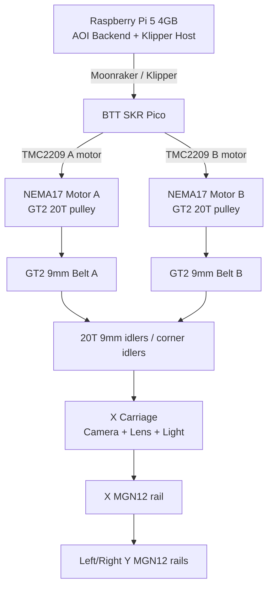

# 320 x 300mm CoreXY / GT2 9mm AOI BOM

> 日期: 2026-05-31  
> 決策: 第一版 AOI 移動平台採用 **320 x 300mm 有效量測範圍 + GT2 9mm 同步帶 + CoreXY 結構**。  
> 參考: Voron 2.4 的 CoreXY 龍門與 9mm GT2 belt / pulley / idler 概念，但本專案只做 AOI XY 平台，不採用 Voron 2.4 的整套 flying gantry / Z platform / 熱床結構。

## 1. 設計目標

| 項目 | 規格 |
|:---|:---|
| 有效量測範圍 | 320 x 300mm |
| 建議外框尺寸 | 約 480 x 450mm 起，實際依相機座、光源、端板與拖鏈微調 |
| XY 傳動 | CoreXY，雙 NEMA17 A/B motor |
| 同步帶 | GT2 / 2GT，9mm width |
| 主要齒輪 | GT2 20T pulley，5mm bore，for 9mm belt |
| 控制板 | BTT SKR Pico V1.0 / Klipper / Moonraker |
| 馬達驅動 | SKR Pico 板載 TMC2209 |
| 導引 | MGN12 linear rail 優先，V-Slot 可作低成本替代 |

## 2. CoreXY 架構圖



CoreXY 的馬達在 Klipper 中不是傳統 X/Y motor，而是 A/B motor。Klipper 會用 `kinematics: corexy` 把 X/Y 指令轉成兩顆馬達的合成運動。

## 3. BOM 表

### 3.1 運動控制

| 項目 | 規格 / 型號 | 硬體規格 | 數量 | 備註 |
|:---|:---|:---|---:|:---|
| 控制板 | BTT SKR Pico V1.0 | RP2040 MCU；板載 4x TMC2209；12/24V input；USB-C to Pi；支援 Klipper | 1 | XY 只用 2 路，保留 Z/E 作光源升降或後續 Z focus |
| 上位機 | Raspberry Pi 5 4GB | 4GB RAM；USB-A 連 SKR Pico；USB3 連相機；建議 NVMe / active cooling | 1 | 跑 AOI backend、Klipper host、Moonraker |
| 步進馬達 | NEMA17，42mm frame，5mm shaft | 建議 1.5A 左右，holding torque 約 40Ncm 以上，軸長約 20~24mm | 2 | CoreXY A/B motor；先不需要 3 顆 XY 馬達 |
| 電源 | 24V 10A DC PSU | 24V output，>= 240W，含保護外殼或 DIN rail 型 | 1 | 供 SKR Pico / 馬達；光源若功率大可另一路供電 |
| 加速度計 | ADXL345 | 3.3V SPI，建議帶固定孔的小板 | 1 | 固定在相機座或 X carriage，做 Input Shaping |
| 限位開關 | Micro switch / optical endstop | 優先 NC 接法；若 micro switch 建議帶滾輪或短柄；線長依機構 | 2~3 | X/Y homing；可加一個安全極限 |

### 3.2 9mm 同步帶與齒輪

| 項目 | 建議規格 | 硬體規格 | 數量 | 尺寸重點 |
|:---|:---|:---|---:|:---|
| GT2 同步帶 | 2GT / GT2 open belt，9mm width | Pitch 2mm；寬 9mm；玻纖芯或高品質橡膠同步帶 | 5m | 實際長度依 belt path 裁切；先買 5m 較安全 |
| 馬達同步輪 | GT2 20T pulley，9mm belt，5mm bore | 20齒；孔徑 5mm；齒寬適配 9mm belt；雙止付螺絲；建議鋁合金或鋼製 | 2 | NEMA17 常見 5mm 軸 |
| 有齒惰輪 | GT2 20T toothed idler，9mm belt，5mm bore | 20齒；孔徑 5mm；齒面適配 9mm belt；含軸承 | 8 | 可依最終 belt path 調整，建議全 20T 降低彎折半徑過小問題 |
| 光滑惰輪 | Smooth idler，9~10mm belt width，5mm bore | 孔徑 5mm；外寬需容納 9mm belt；帶法蘭較好 | 0~4 | 若 belt back-side 需要繞行才使用 |
| 惰輪軸 | 5mm shaft / shoulder bolt | 5mm 直徑；長度依 idler stack 與支架厚度；需搭配墊片 | 8~12 | 對應 5mm bore idler |
| 惰輪墊片 | 5mm ID shim / spacer | 內徑 5mm；多種厚度 0.5/1/2mm | 1 批 | 用來調整皮帶高度與防止磨邊 |
| 皮帶固定片 | 9mm belt clamp | 夾持寬度 >= 9mm；建議雙螺絲固定；可列印或鋁件 | 2~4 | 固定在 X carriage，需可微調張力 |
| 張力調整機構 | Belt tensioner | 可調行程建議 >= 5mm；M3/M4 調整螺絲 | 2 | 左右 belt tension 要一致 |

**齒輪尺寸建議**

| 零件 | 規格 |
|:---|:---|
| Pulley tooth profile | GT2 / 2GT |
| Pitch | 2mm |
| Tooth count | 20T |
| Belt width | 9mm |
| Motor pulley bore | 5mm |
| Idler bore | 5mm |
| Pulley / idler outer diameter | 20T GT2 常見外徑約 12~13mm，依供應商圖面確認 |

Voron 2.4 常見 motion kit 會使用 GT2 20T pulley、GT2 20T toothed idler、9mm open belt 等項目。本專案可沿用這個規格生態，方便採購與替換。

### 3.3 線性導引與框架

| 項目 | 建議規格 | 硬體規格 | 數量 | 備註 |
|:---|:---|:---|---:|:---|
| X 軸線性導軌 | MGN12H，400~450mm | Rail width 12mm；H block；建議 preload Z0/Z1；每條 1 個滑塊起 | 1 | 相機座沿 X 軸移動 |
| Y 軸線性導軌 | MGN12H，400~450mm | Rail width 12mm；H block；左右各一條；每條 1 個滑塊起 | 2 | 左右 Y rail，支撐 X gantry |
| 鋁擠型外框 | 2020 / 2040 profile | 建議 2020 起；若要提高剛性可用 2040 作 Y 邊梁 | 1 批 | 外框約 480 x 450mm 起 |
| X 橫樑 | 2020 或輕量 2040 | 長度約 400~450mm；需與 X rail 固定面平直 | 1 | 320mm 範圍可先用 2020，若光源重則改 2040 |
| 角碼 / T nuts / 螺絲 | M5 系列 | M5 T-nut、M5x8/M5x10/M5x12；角碼建議金屬 | 1 批 | 鋁擠型組裝 |
| X carriage 板 | 鋁板 3~5mm 或高強度列印件 | 建議鋁板厚 3~5mm；需預留相機、鏡頭、光源與 belt clamp 孔位 | 1 | 固定相機、鏡頭、光源、皮帶夾 |
| A/B motor mount | 鋁件或高強度列印件 | NEMA17 31mm 方孔距；需可調皮帶高度或搭配墊片 | 2 | 建議金屬化，避免張力造成變形 |
| Idler mount | 鋁件或高強度列印件 | 支援 5mm idler shaft；左右高度需一致 | 4~8 | 需確保左右高度一致 |

### 3.4 相機、線材與安全件

| 項目 | 規格 | 硬體規格 | 數量 | 備註 |
|:---|:---|:---|---:|:---|
| 相機 | IMX296 Global Shutter USB3 | 1440 x 1080；global shutter；USB3；C/CS mount 依模組 | 1 | 固定在 X carriage |
| 鏡頭 | 16mm C-Mount Machine Vision Lens | 3MP/5MP 等級；低畸變；可鎖焦/鎖光圈優先 | 1 | 工作距離約 13cm |
| 光源 | 環形光 / 條光 / 同軸光候選 | 24V 或 12V 版本；需另配 MOSFET/relay 或恆流控制 | 1 | 第一版可先環形光 |
| USB3 高柔線 | 1~2m，拖鏈可用 | USB3 A-to-camera connector 依相機；高柔、細線、屏蔽 | 1 | 越短越好 |
| 拖鏈 | 10x15mm 或相近 | 內徑需容納 USB3、光源線、限位線；彎曲半徑需符合線材 | 1 | 方案二用量較少 |
| 馬達線 | 4-pin high-flex | 4芯；建議 22~24AWG；拖鏈用 | 2 | A/B motor |
| 限位線 | 2-pin shielded / twisted pair | 2芯；建議屏蔽或雙絞；NC 接法 | 2~3 | NC 接法優先 |
| 急停 | NC mushroom E-stop | 22mm panel mount 常見；NC contact；額定需符合 24V 控制迴路 | 1 | 硬體切 24V motor power 或 enable |
| 保險絲 / 斷路器 | 24V line protection | 5~10A 依實際負載選型；建議放在 PSU 後 | 1 | 控制箱安全 |

## 3.5 硬體規格摘要

| 類別 | 第一版規格 |
|:---|:---|
| 有效量測範圍 | 320 x 300mm |
| 外框估算 | 約 480 x 450mm 起 |
| 傳動形式 | CoreXY |
| 同步帶 | GT2 / 2GT，pitch 2mm，width 9mm |
| Motor pulley | GT2 20T，5mm bore，for 9mm belt |
| Idler | GT2 20T toothed idler，5mm bore，for 9mm belt |
| Motor | NEMA17，42mm frame，5mm shaft，約 1.5A |
| Driver | SKR Pico onboard TMC2209 |
| Linear rail | MGN12H，400~450mm |
| Controller | BTT SKR Pico V1.0 + Raspberry Pi 5 4GB |
| Power | 24V 10A DC PSU |
| Motion firmware | Klipper，`kinematics: corexy` |

## 4. Klipper 設定方向

CoreXY 使用兩顆馬達，不是 X/Y 各一顆直接對應。Klipper 設定重點:

```ini
[printer]
kinematics: corexy
max_velocity: 150
max_accel: 800
square_corner_velocity: 2

[stepper_x]
step_pin: gpio...
dir_pin: gpio...
enable_pin: !gpio...
microsteps: 16
rotation_distance: 40
endstop_pin: ^gpio...
position_min: 0
position_max: 320
homing_speed: 30

[stepper_y]
step_pin: gpio...
dir_pin: gpio...
enable_pin: !gpio...
microsteps: 16
rotation_distance: 40
endstop_pin: ^gpio...
position_min: 0
position_max: 300
homing_speed: 30
```

GT2 20T pulley 的 `rotation_distance`:

```text
20 teeth * 2mm pitch = 40mm / motor revolution
rotation_distance = 40
```

初始保守參數:

| 參數 | 建議起點 |
|:---|---:|
| `max_velocity` | 100~150 mm/s |
| `max_accel` | 300~800 mm/s² |
| `square_corner_velocity` | 2~3 mm/s |
| TMC2209 `run_current` | 0.7~0.9A |
| 拍照前 settling delay | 100~200ms 起測 |

AOI 不需要追求 Voron 2.4 的高速列印加速度。第一版應以低震動、低回彈、拍照清晰為主。

## 5. 張力與共振控制

GT2 9mm 比 6mm 更適合此平台，因為張力裕度與剛性更好。仍需注意:

- A/B 兩條同步帶張力要一致。
- 左右 belt path 高度要一致，避免皮帶磨邊。
- Idler / pulley 必須共面。
- Motor mount 與 idler mount 不可太軟，否則張力會讓座體變形。
- ADXL345 必做 Input Shaping。
- AOI backend 到點後仍保留 100~200ms settling delay。

建議在實機驗證時記錄:

- 不同張力下的 ADXL345 共振頻率。
- 到點後 50/100/150/200ms 拍照清晰度。
- 連續掃描 1 小時後皮帶張力是否漂移。
- 皮帶是否磨邊或掉粉。

## 6. 與 Voron 2.4 參考關係

可參考 Voron 2.4:

- CoreXY belt path 概念。
- GT2 / 2GT 9mm belt 生態。
- 20T pulley / 20T toothed idler 常見規格。
- MGN 線性導軌與剛性 gantry 思路。
- Klipper + Input Shaping 的調機方式。

不直接照抄:

- Voron 2.4 的 flying gantry / Z belt / 熱床 / 封箱結構。
- 高速列印取向的極限加速度。
- 熱艙材料要求。

AOI 版本要更重視:

- 拍照點停穩。
- 相機線材拖曳力。
- 光源與鏡頭重量。
- 長時間重複定位。
- 低速低震動，而非高速列印。

## 7. 參考資料

- Voron sourcing documentation: https://docs.vorondesign.com/sourcing.html
- Voron 2.4 motion kit examples commonly list GT2 20T pulley / toothed idler for 9mm belt, 5mm bore.
- Klipper Config Reference: https://www.klipper3d.org/Config_Reference.html
