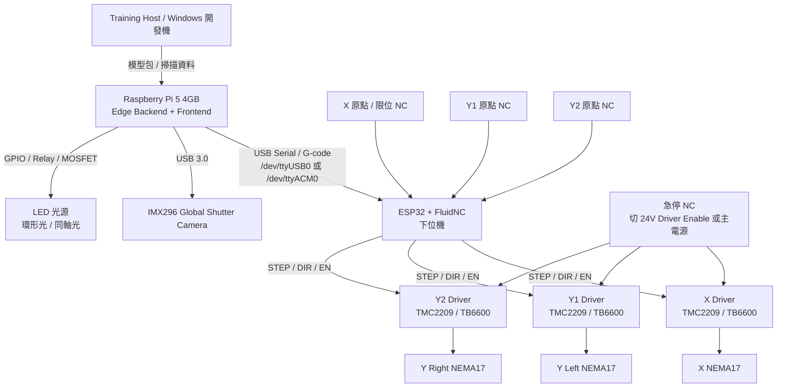
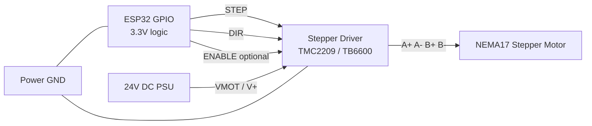
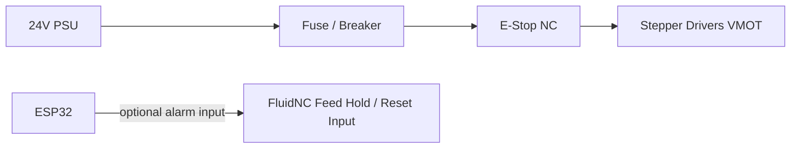

# ESP32 / FluidNC 下位機評估報告

> 日期: 2026-05-31  
> 目的: 評估以 ESP32 + FluidNC 作為 AOI 下位機的難度、架構、接線、程式設定與硬體電子元件需求。  
> 結論摘要: **可行，但若用裸 ESP32 自行接線，硬體整合難度高於 SKR Pico/Klipper。若走 ESP32 路線，建議使用已整合 ESP32 + TMC2209 的 FluidNC CNC 控制板，而不是裸 ESP32 DevKit。**

## 1. 難度評估

| 項目 | 難度 | 說明 |
|:---|:---:|:---|
| FluidNC 韌體安裝 | 低 | 主要透過 Web Installer 或燒錄工具安裝，設定集中在 `config.yaml`。 |
| Raspberry Pi 與 ESP32 通訊 | 低 | 推薦 USB Serial，Pi 後端以 `pyserial` 發送 G-code。 |
| 單軸 STEP/DIR 控制 | 中 | ESP32 GPIO 輸出 STEP/DIR/ENABLE 到驅動器即可，但需確認 3.3V 訊號能被 driver 穩定識別。 |
| 雙 Y 軸龍門 | 中高 | 需要 Y1/Y2 獨立 driver；若要 auto-square，需兩個 Y 原點開關與正確 homing 設定。 |
| 限位/急停/復位 | 中高 | 需要 NC 接法、拉高/濾波、抗雜訊、急停斷電邏輯，不能只靠軟體停機。 |
| 抗干擾與配線 | 高 | 馬達線、限位線、USB 線、24V 電源與相機線共存，若無隔離/屏蔽容易誤觸發。 |
| 長時間產線穩定性 | 中高 | ESP32/FluidNC 本身可行，但自製板品質、接地、端子、散熱與電源會決定可靠度。 |

**整體判斷:**  
ESP32/FluidNC 對 AOI XY 龍門是可行方案。真正的風險不是「程式寫不出來」，而是硬體接線、限位安全、雙 Y 軸同步與抗干擾。若第一版想快點穩定落地，SKR Pico/Klipper 較省心；若想保留 CNC/G-code 生態與 Wi-Fi 管理，ESP32/FluidNC 可作為低成本候選。

## 2. 建議系統架構

### 2.1 完整控制架構



### 2.2 Raspberry Pi 與 ESP32 連線

**推薦: USB Serial**

```text
Raspberry Pi USB-A
  -> USB cable
  -> ESP32 USB port
  -> FluidNC serial interface
```

Pi 後端以序列埠發送 G-code，例如:

```text
G90              ; absolute positioning
G21              ; mm unit
$H               ; homing
G0 X120 Y80 F3000
M400             ; wait until motion complete
?                ; status query
```

USB Serial 優點是簡單、延遲低、設定少。ESP32 的 Wi-Fi/Web UI 可保留作維護用途，但正式 AOI 掃描流程不建議依賴 Wi-Fi 控制運動。

## 3. ESP32 與馬達接線

以下以「裸 ESP32 DevKit + 外接 stepper driver」示意。若使用整合式 FluidNC 4 軸控制板，這些接線多數已在板上完成。

### 3.1 STEP/DIR Driver 接線



基本接線表:

| ESP32 / 電源 | Driver 端 | 說明 |
|:---|:---|:---|
| GPIO_STEP_X | X STEP / PUL | 脈衝輸出 |
| GPIO_DIR_X | X DIR | 方向輸出 |
| GPIO_EN | EN / ENABLE | 可共用，低/高有效視 driver 而定 |
| GND | GND / PUL- / DIR- | 必須共地 |
| 24V+ | VMOT / V+ | 馬達電源 |
| 24V- | VMOT- / GND | 馬達電源地 |
| A+, A-, B+, B- | 馬達兩相線圈 | 需先用萬用表找出線圈對 |

**注意:** ESP32 是 3.3V GPIO。部分 TB6600/光耦輸入希望 5V 訊號，3.3V 可能邊界不穩。若測試有漏步或不動，需加 74HCT buffer、MOSFET level shifter 或改用支援 3.3V STEP/DIR 的 driver。

### 3.2 建議 GPIO 分配

此表只是範例，實作前需依實際 ESP32 板子確認 boot strap pin、保留 pin、輸入專用 pin。

| 功能 | 建議 GPIO | 備註 |
|:---|:---:|:---|
| X_STEP | GPIO25 | 避免使用 boot strap pin |
| X_DIR | GPIO26 |  |
| Y1_STEP | GPIO27 |  |
| Y1_DIR | GPIO14 | 注意部分板子啟動狀態 |
| Y2_STEP | GPIO32 |  |
| Y2_DIR | GPIO33 |  |
| ENABLE | GPIO13 | 可接所有 driver enable |
| X_LIMIT_NC | GPIO34 | input only，可外接上拉 |
| Y1_LIMIT_NC | GPIO35 | input only，可外接上拉 |
| Y2_LIMIT_NC | GPIO39 | input only，可外接上拉 |
| PROBE / spare | GPIO36 | input only |

## 4. 限位、復位與急停

### 4.1 限位開關

建議使用 **NC normally-closed** 接法:

```text
ESP32 GPIO input ---- NC limit switch ---- GND
GPIO 啟用 pull-up 或外接 4.7k~10k pull-up 到 3.3V
```

優點:

- 線斷、接頭鬆脫時會變成觸發狀態，比 NO 安全。
- 對產線設備較合理。
- 雙 Y 軸可使用 Y1/Y2 兩個獨立原點開關做 auto-square。

建議加:

- 0.1uF 小電容到 GND 做簡單濾波。
- 使用屏蔽線或雙絞線走拖鏈。
- 限位線與馬達線分開走線。
- 嚴重干擾環境可加光耦隔離模組。

### 4.2 復位開關

ESP32 DevKit 通常已有 EN/RESET 按鈕。若拉到控制箱面板:

```text
EN pin ---- momentary push button ---- GND
```

用途是重啟 ESP32/FluidNC，不應作為急停。復位後機器座標會失效，需重新 homing。

### 4.3 急停

急停建議用硬體 NC 蘑菇頭，至少切斷 driver enable 或 24V 馬達電源:



最低限度:

- 急停切斷馬達 driver enable 或 24V motor power。
- ESP32 可另接一個 alarm input，讓軟體知道急停發生。
- 急停解除後必須重新 homing，不應直接接續原本座標。

## 5. FluidNC 設定略寫法

FluidNC 的主要工作是把 G-code 轉成 ESP32 GPIO 的 STEP/DIR 脈衝。硬體配置寫在 `config.yaml`。

下面是 AOI XY + 雙 Y 馬達的概念範例，pin 需依實際板子修改:

```yaml
board: ESP32_AOI_XYY
name: low-cost-aoi-fluidnc

stepping:
  engine: RMT
  idle_ms: 255
  pulse_us: 4
  dir_delay_us: 1
  disable_delay_us: 0

axes:
  shared_stepper_disable_pin: gpio.13

  x:
    steps_per_mm: 80.000
    max_rate_mm_per_min: 6000.000
    acceleration_mm_per_sec2: 300.000
    max_travel_mm: 600.000
    soft_limits: true
    homing:
      cycle: 2
      positive_direction: false
      mpos_mm: 0
      seek_mm_per_min: 1200
      feed_mm_per_min: 120
    motor0:
      limit_neg_pin: gpio.34:low:pu
      hard_limits: true
      pulloff_mm: 3.000
      standard_stepper:
        step_pin: gpio.25
        direction_pin: gpio.26

  y:
    steps_per_mm: 80.000
    max_rate_mm_per_min: 6000.000
    acceleration_mm_per_sec2: 300.000
    max_travel_mm: 800.000
    soft_limits: true
    homing:
      cycle: 1
      positive_direction: false
      mpos_mm: 0
      seek_mm_per_min: 1200
      feed_mm_per_min: 120
    motor0:
      limit_neg_pin: gpio.35:low:pu
      hard_limits: true
      pulloff_mm: 3.000
      standard_stepper:
        step_pin: gpio.27
        direction_pin: gpio.14
    motor1:
      limit_neg_pin: gpio.39:low:pu
      hard_limits: true
      pulloff_mm: 3.000
      standard_stepper:
        step_pin: gpio.32
        direction_pin: gpio.33
```

`steps_per_mm` 計算範例:

```text
NEMA17 1.8deg = 200 full steps/rev
TMC2209 16 microsteps
GT2 20T pulley = 20 teeth * 2mm = 40mm/rev

steps_per_mm = 200 * 16 / 40 = 80 steps/mm
```

Pi 後端略寫法:

```python
import serial
import time

class FluidNCMotion:
    def __init__(self, port="/dev/ttyUSB0", baud=115200):
        self.ser = serial.Serial(port, baudrate=baud, timeout=1)
        time.sleep(2)

    def command(self, gcode: str) -> list[str]:
        self.ser.write((gcode.strip() + "\n").encode("ascii"))
        lines = []
        while True:
            line = self.ser.readline().decode("utf-8", errors="replace").strip()
            if not line:
                break
            lines.append(line)
            if line == "ok" or line.startswith("error:"):
                break
        return lines

    def home(self):
        return self.command("$H")

    def move_to(self, x: float, y: float, feed=3000):
        self.command("G90")
        return self.command(f"G0 X{x:.3f} Y{y:.3f} F{feed}")

    def status(self):
        self.ser.write(b"?\n")
        return self.ser.readline().decode("utf-8", errors="replace").strip()
```

## 6. 相關硬體電子元件清單

### 6.1 最小可動版本

| 元件                                |  數量 | 說明                                   |
| :-------------------------------- | --: | :----------------------------------- |
| ESP32 DevKit 或 FluidNC 控制板        |   1 | 裸 DevKit 最便宜，但整合式 FluidNC 板較建議。      |
| TMC2209 stepstick 或 TB6600 driver |   3 | X、Y1、Y2。若未來 Z 軸對焦，需第 4 路。            |
| NEMA17 stepper motor              |   3 | X、Y1、Y2。                             |
| 24V 10A PSU                       |   1 | 供馬達 driver。                          |
| 24V -> 5V buck converter          |   1 | 若不用 USB 供 ESP32，需降壓供電。               |
| Micro switch NC                   |   3 | X、Y1、Y2 原點/限位。                       |
| 急停蘑菇頭 NC                          |   1 | 建議串 24V driver enable 或 motor power。 |
| 保險絲 / 斷路器                         |   1 | 24V 主電源保護。                           |
| 端子台 / 接線端子                        | 1 批 | 控制箱內配線。                              |
| 馬達線 4 芯高柔                         | 3 條 | 拖鏈用。                                 |
| 限位線 2 芯屏蔽或雙絞                      | 3 條 | 抗干擾。                                 |

### 6.2 建議加強版本

| 元件 | 用途 |
|:---|:---|
| 光耦隔離輸入模組 | 限位/急停抗干擾。 |
| 74HCT buffer / level shifter | ESP32 3.3V STEP/DIR 轉 5V，給 TB6600 類 driver。 |
| TVS diode / EMI ferrite | 抑制馬達與拖鏈線路雜訊。 |
| 金屬控制箱 + 接地銅排 | 降低 EMI，提升安全性。 |
| DIN rail PSU / terminal blocks | 讓維修與配線可控。 |
| USB 隔離器或短高品質 USB 線 | 降低 USB 雜訊與斷線風險。 |

## 7. ESP32 路線的主要風險

1. **裸板接線容易鬆散**  
   杜邦線不適合長期機台振動。若用 ESP32 DevKit，應製作轉接板或端子板。

2. **3.3V 訊號相容性**  
   ESP32 GPIO 是 3.3V，部分外接 driver 對 STEP/DIR 的高電位門檻不友善。

3. **雙 Y 軸校正比想像中敏感**  
   如果 Y1/Y2 原點開關位置不一致，龍門會斜。需要可調開關座與 homing pulloff 微調。

4. **限位開關誤觸發**  
   馬達線與限位線同拖鏈時，沒有屏蔽/濾波容易造成 alarm。

5. **急停不能只靠 FluidNC**  
   軟體 reset/feed hold 不等於安全急停。真正急停要切硬體。

## 8. 建議方案

### 若目標是最低總成本

可用:

```text
ESP32 DevKit + TMC2209 stepstick x3 + 自製端子板 + FluidNC
```

但這條路需要較多硬體整合與除錯時間，不建議第一台 AOI 直接採用。

### 若目標是 ESP32/FluidNC 且可穩定落地

建議:

```text
整合式 FluidNC 4-axis board
例如 ESP32 + 4x TMC2209 的 CNC 控制板
```

優點是 driver、端子、電源與 pin map 已經整合，FluidNC 設定範例通常也較完整。

### 與 SKR Pico/Klipper 比較

| 評估項 | ESP32 / FluidNC | SKR Pico / Klipper |
|:---|:---|:---|
| 裸材料最低價 | 較低 | 中低 |
| 完整控制板價格 | 中 | 中低 |
| 接線難度 | 較高 | 較低 |
| Pi 整合 | USB Serial / G-code | Klipper 原生 Pi host 架構 |
| CNC 語意 | 較直接 | 需以 Klipper 設定/宏整合 |
| 雙 Y auto-square | 可行但需細調 | 可行，設定生態成熟 |
| 第一版 AOI 風險 | 中高 | 中 |

**最終建議:**  
如果目前只是選第一版硬體，仍建議維持 **SKR Pico/Klipper**。若後續要做更 CNC 化、可離線、Wi-Fi 設定、G-code 生態更直接的版本，再把 **ESP32/FluidNC** 作為第二候選。若堅持 ESP32，請選整合式 FluidNC CNC 控制板，不要用麵包板/杜邦線方案進入實機。

## 9. 參考資料

- FluidNC config file overview: https://github-wiki-see.page/m/Longus/FluidNC/wiki/FluidNC-Config-File-Overview
- FluidNC config.yaml reference: https://github-wiki-see.page/m/Longus/FluidNC/wiki/config.yaml-Reference
- FluidNC motor setup: https://github-wiki-see.page/m/Longus/FluidNC/wiki/FluidNC-Motor-Setup
- FluidNC homing: https://github-wiki-see.page/m/Longus/FluidNC/wiki/FluidNC-Homing
- Elecrow 4-axis FluidNC controller with ESP32 + TMC2209: https://www.elecrow.com/4x-cnc-controller-integrated-esp32-and-tmc2209.html
- BIGTREETECH Rodent FluidNC board: https://biqu.equipment/products/bigtreetech-rodent
