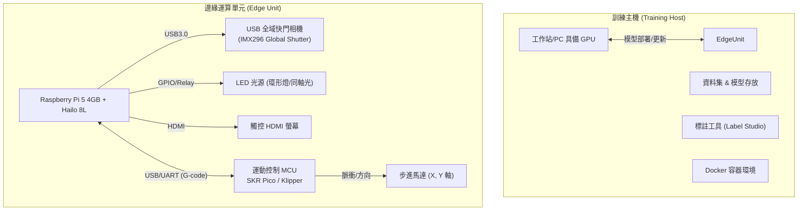
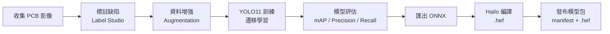

# 低成本 PCB AOI 系統 — 功能說明書

> **文件版本**: 1.1  
> **最後更新**: 2026-06-01  
> **專案名稱**: Low-Cost PCB AOI System (低成本 PCB 自動光學檢測系統)

---

## 目錄

1. [專案概述](#1-專案概述)
2. [系統整體架構](#2-系統整體架構)
3. [硬體功能規格](#3-硬體功能規格)
4. [軟體功能規格](#4-軟體功能規格)
5. [Edge 邊緣單元功能](#5-edge-邊緣單元功能)
6. [Training Host 訓練主機功能](#6-training-host-訓練主機功能)
7. [資料交換契約](#7-資料交換契約)
8. [AI 視覺辨識流程](#8-ai-視覺辨識流程)
9. [使用者介面](#9-使用者介面)
10. [部署環境](#10-部署環境)
11. [階段實施計畫](#11-階段實施計畫)
12. [附錄：與商用 AOI 差異分析](#12-附錄與商用-aoi-差異分析)

---

## 1. 專案概述

### 1.1 專案目標

建構一套 **低成本、開源、可自主部署** 的 PCB 自動光學檢測 (AOI) 系統，使小型電子製造商、PCB 打樣廠、維修站與 DIY 愛好者能夠以約 NT$16,500 的硬體成本，獲得具備 AI 深度學習缺陷辨識能力的自動化光學檢測方案。

### 1.2 適用場景

- PCB 內層板 (Inner Layer) 棕化面檢測
- 軟硬結合板 (Rigid-Flex PCB) 外觀檢測
- 金手指 (Gold Finger) 表面異物與間距檢測
- 軟板成型邊緣毛邊/撕裂檢測
- 小批量產線或打樣站品質檢驗

### 1.3 核心設計原則

| 原則 | 說明 |
|:---|:---|
| **低成本** | 優先選用樹莓派、開源韌體、通用硬體，捨棄非必要功能以控制成本 |
| **邊緣運算** | AI 推理在機台端即時執行，無需依賴雲端或區域網路 |
| **模組化** | Edge 機台與 Training Host 明確分工，透過標準化契約交換資料 |
| **開源可複製** | 所有軟體、BOM、機構設計皆開源，任何人都可自行複製搭建 |

---

## 2. 系統整體架構

系統由兩大實體與三個部署環境組成：



### 2.1 三種部署環境

| 環境 | 用途 | 說明 |
|:---|:---|:---|
| **Windows Edge 模擬** | 開發/測試 | `windows-edge-simulator/` 內的 `edge-backend` + `edge-frontend` 以 Docker Compose 在 Windows 本機執行，`SIMULATION_MODE=true` 模擬相機與運動控制，並以 Raspberry Pi 邊緣裝置效能為設計約束 |
| **Raspberry Pi Edge 實機** | 產線部署 | `raspberry-pi/` 目錄下的原生部署，backend 以 systemd 執行、frontend 由 nginx 提供，Phase 2 先完成相機截圖與資料回收，Phase 3 再啟用 Hailo 8L 邊緣推理 |
| **Training Host** | 訓練/管理 | PC 或工作站執行，提供資料集管理、Label Studio 標註、YOLO 訓練、驗證、模型封裝與部署模型包下載/API |

---

## 3. 硬體功能規格

### 3.1 BOM 與費用一覽

| 類別 | 金額 (TWD) |
|:---|:---:|
| 核心運算與視覺 | $8,100 |
| 運動控制系統 | $1,100 |
| 機構與傳動 | $5,750 |
| 線材與電源 | $1,540 |
| **總計** | **$16,490** |

### 3.2 核心組件規格

| 組件 | 型號/規格 | 功能 |
|:---|:---|:---|
| **SBC 主板** | Raspberry Pi 5 4GB | AI 推理核心、系統控制、UI 伺服；功能設計需控制 RAM 峰值 |
| **AI 加速器** | Hailo-8L M.2 Kit (13 TOPS) | YOLO 模型硬體加速推理 |
| **相機** | Arducam IMX296 Global Shutter USB | 全域快門，適合動態拍攝，USB 3.0 介面 |
| **鏡頭** | 16mm C-Mount Machine Vision Lens | 工作距離 ~13cm，FOV 30mm×30mm，解析度 36 px/mm |
| **運動主控板** | BTT SKR Pico V1.0 (RP2040) | 執行 Klipper MCU firmware，產生步進脈衝 |
| **馬達驅動** | TMC2209 (UART Mode) | 靜音驅動，支援 Sensorless Homing |
| **加速度計** | ADXL345 (SPI) | Klipper Input Shaping 共振補償 |
| **機構** | 龍門式 XY 平台 + CoreXY / GT2 9mm 同步帶 | 第一版採 320×300mm 有效量測範圍；620×550mm 保留為放大版 |

### 3.3 Raspberry Pi 5 4GB 資源約束

實機已採用 Raspberry Pi 5 4GB，因此 Windows Edge Simulator 與 Raspberry Pi production 版本需共用同一套資源假設：

| 約束項目 | 設計要求 |
|:---|:---|
| **模型載入** | 不在服務啟動時載入全部模型；僅載入 active model 或使用者選定模型 |
| **影像處理** | 避免同時保留多份原始影像、縮放影像與推理輸入；流程完成後釋放中間資料 |
| **歷史資料** | Capture / Review 清單需分頁或摘要化，不一次載入全部圖片內容 |
| **前端建置** | 前端 build 預設在 Windows / Training Host 執行，再部署靜態檔到 Pi |
| **模擬器開發** | Windows 模擬器新增功能時，需確認可移植到 Pi 5 4GB，不以桌機 RAM 為基準 |

### 3.4 光學系統規格

| 項目 | 規格 |
|:---|:---|
| **感測器解析度** | 1440 × 1080 (IMX296) |
| **視野 (FOV)** | 30mm × 30mm |
| **解析能力** | 36 pixels/mm |
| **最小可檢測缺陷** | 0.1mm (4 mil)，約 3.6 像素 |
| **推薦光圈** | F/8.0 (兼顧景深與進光量) |
| **景深** | ~3.2mm (理論值 @ F/8.0) |
| **光源方案** | 白色同軸光 (金手指檢測) + 環形光 (棕化面/軟板) |

---

## 4. 軟體功能規格

### 4.1 軟體技術堆疊

#### Edge 邊緣後端 (Python)

| 元件 | 版本/技術 |
|:---|:---|
| **語言** | Python 3.10 / 3.11 |
| **Web 框架** | FastAPI (v0.109+) + Uvicorn |
| **電腦視覺** | OpenCV-Python (v4.9+) |
| **AI 推理** | ONNX Runtime (v1.16+) / HailoRT (v4.16+) |
| **序列通訊** | pyserial (v3.5) |

#### Edge 邊緣前端 (Web UI)

| 元件 | 版本/技術 |
|:---|:---|
| **Runtime** | Node.js v20 LTS |
| **框架** | React v18.2+ |
| **建置工具** | Vite v5.0+ |
| **UI 程式庫** | ShadcnUI (Radix UI + Tailwind CSS v3.4) |

#### Training Host 訓練主機

| 元件 | 版本/技術 |
|:---|:---|
| **作業系統** | Windows 10/11 或 Ubuntu 22.04 LTS |
| **AI 框架** | PyTorch v2.1+, Torchvision |
| **物件偵測** | Ultralytics YOLO11 |
| **CUDA** | v12.1 (NVIDIA GPU 環境) |
| **容器化** | Docker + Docker Compose |

### 4.2 訓練主機 Docker 服務

| 服務 | Port | 用途 |
|:---|:---:|:---|
| `training-backend` | 8000 | 核心訓練後端 API (FastAPI) |
| `training-frontend` | 3000 | 訓練儀表板 UI (Nginx) |
| `redis` | 6379 | 非同步任務佇列 |
| `tensorboard` | 6006 | 訓練可視化 |
| `label-studio` | 8080 | 資料標註工具 |

---

## 5. Edge 邊緣單元功能

### 5.1 檢測流程 (Inspection Pipeline)

```
┌──────────┐    ┌──────────┐    ┌──────────┐    ┌──────────┐    ┌──────────┐
│ 載入掃描  │───▶│ 移至目標  │───▶│ 相機拍攝  │───▶│ AI 推理   │───▶│ 結果判定  │
│ 程式      │    │ 點位      │    │          │    │ (YOLO)   │    │ OK/NG    │
└──────────┘    └──────────┘    └──────────┘    └──────────┘    └──────────┘
                                                                    │
                                                                    ▼
                                                        ┌──────────────────┐
                                                        │ 生成報告 & 上傳  │
                                                        │ 至 Training Host │
                                                        └──────────────────┘
```

### 5.2 核心功能列表

| 功能 | 說明 | 狀態 |
|:---|:---|---:|
| **掃描程式管理** | 載入/儲存/執行掃描路徑 (G-code Program) | ✅ |
| **運動控制** | 透過序列埠發送 G-code，控制 XY 龍門定位 | ✅ |
| **相機控制** | USB 3.0 全域快門相機觸發拍攝與參數設定 | ✅ |
| **光源控制** | 透過 GPIO/Relay 切換光源 (環形燈/同軸光) | ✅ |
| **AI 推理** | 載入 Hailo .hef 模型，執行 YOLO 物件偵測 | ✅ |
| **即時影像** | 低延遲相機串流顯示於前端 UI | ✅ |
| **缺陷標記** | 在 PCB 縮圖上標記缺陷位置 (Defect Map) | ✅ |
| **OK/NG 指示** | 全螢幕紅綠燈號，醒目提示檢測結果 | ✅ |
| **報告生成** | 輸出 `report.json`，包含每個檢測點結果與影像路徑 | ✅ |
| **資料上傳** | 將 Run Bundle (影像+報告) 上傳至 Training Host | ✅ |
| **Transfer UI** | 將 ready captures bundle 上傳至 Training Host，並可將 model bundle zip 安裝到 Edge | ✅ |
| **手動 Jog** | 工程模式下手動移動龍門 | ✅ |
| **參數設定** | 調整馬達速度、相機曝光、推理門檻值 | ✅ |

### 5.3 狀態機 (Orchestrator State Machine)

| 狀態 | 說明 |
|:---|:---|
| `Idle` | 待機，等待操作指令 |
| `Loading` | 載入掃描程式 |
| `Moving` | 龍門移動至目標點位 |
| `Capturing` | 相機拍攝中 |
| `Inferring` | AI 推理執行中 |
| `Completed` | 檢測完成 |
| `Error` | 錯誤狀態 (可復原) |

---

## 6. Training Host 訓練主機功能

### 6.1 功能列表

| 功能 | API 端點 | 說明 |
|:---|:---|---:|
| **資料集匯入** | `POST /api/datasets/import-run` | 接收 Edge / Simulator 上傳的 capture 或 run bundle zip |
| **資料集瀏覽** | `GET /api/datasets` | 檢視已上傳的 PCB 影像與標註 |
| **訓練任務啟動** | `POST /api/training/start` | 啟動物件偵測模型訓練 (YOLO11) |
| **訓練監控** | (整合 TensorBoard) | 即時 Loss / mAP 曲線 |
| **模型列表** | `GET /api/training/models` | 列出可發布的 Hailo 模型包 |
| **模型下載** | `GET /api/training/models/{id}/download` | 下載 `.hef` 模型包供 Edge 使用 |
| **模型匯出** | `POST /api/training/models/{id}/export` | 將 PyTorch 權重轉為 ONNX 再編譯為 Hailo .hef |

### 6.2 缺陷分類定義

| 類別 ID | 缺陷名稱 | 說明 | 建議光源 |
|:---|:---|:---|:---|
| `fm_on_gold` | 金手指表面異物 | 同軸光下呈黑點 | 同軸光 |
| `fm_in_gap` | 金手指間距異物 | 短路風險 | 同軸光 |
| `oxidized_surface_scratch` | 內層棕化面刮傷 | 銅面刮傷/氧化 | 環形光 |
| `edge_burr` | 軟板成形毛邊 | 切割邊緣毛刺 | 環形光 |
| `edge_tear` | 軟板撕裂/缺角 | 邊緣缺損 | 環形光 |

### 6.3 模型格式

| 階段          | 格式              | 說明                                          |
| :---------- | :-------------- | :------------------------------------------ |
| 訓練中         | `.pt` (PyTorch) | Ultralytics YOLO11 權重格式                     |
| 中間格式        | `.onnx`         | ONNX Runtime 通用格式                           |
| **Edge 部署** | **`.hef`**      | Hailo-8L 專用格式，需經 Hailo Dataflow Compiler 編譯 |
| 部署附帶        | `manifest.json` | 符合 `model_manifest.schema.json` 的模型中繼資料     |

---

## 7. 資料交換契約

### 7.1 Run Bundle (Edge → Training Host)

Edge 每次檢測完成後，可將一個 Run Bundle 壓縮為 Zip 上傳至 Training Host。
Phase 2 截圖模式也可將 ready captures 匯出為相同方向的 Training Host 匯入 zip。傳輸方式支援 USB 離線搬移，也支援 Edge / Simulator 前端 Transfer UI 直接呼叫 Training Host `POST /api/datasets/import-run`。

**Bundle 目錄結構：**

```
run_bundle_20260113_103042.zip
├── manifest.json       # 符合 dataset_bundle.schema.json
├── report.json         # 符合 inspection_run.schema.json
├── program.json        # 本次檢測使用的掃描程式
└── images/
    ├── 001.jpg
    ├── 002.jpg
    └── ...
```

**`report.json` 主要欄位：**

| 欄位 | 類型 | 說明 |
|:---|:---|---:|
| `metadata.program_name` | string | 掃描程式名稱 |
| `metadata.part_no` | string | PCB 料號 |
| `metadata.batch_no` | string | 批號 |
| `metadata.machine_id` | string | 機台 ID |
| `metadata.model_id` | string | AI 模型 ID |
| `total_points` | integer | 總檢測點數 |
| `results[].point_id` | integer | 點位編號 |
| `results[].x, y` | number | 物理座標 (mm) |
| `results[].result` | string | `"OK"` 或 `"NG"` |
| `results[].detections[].label` | string | 缺陷類別名稱 |
| `results[].detections[].confidence` | number | 信心度 (0~1) |
| `results[].detections[].box` | [number×4] | 像素座標 `[x, y, w, h]` |
| `results[].image_path` | string | 對應 images/ 下的檔名 |
| `status` | string | `"completed"` / `"error"` / `"stopped"` |

### 7.2 Model Manifest (Training Host → Edge)

| 欄位 | 類型 | 說明 |
|:---|:---|---:|
| `model_id` | string | 模型唯一識別碼 |
| `format` | string | 固定為 `"hailo-hef"` |
| `source_yolo_model` | string | 原始 YOLO 模型名稱 (如 `yolo11n`) |
| `classes` | string[] | 缺陷類別名稱列表 |
| `input_size` | [int, int] | 模型輸入尺寸 (如 `[640, 640]`) |
| `postprocess.type` | string | 後處理類型 |
| `postprocess.confidence_threshold` | number | 信心度門檻 (預設 0.5) |
| `postprocess.iou_threshold` | number | IOU 門檻 |
| `checksum.sha256` | string | 模型檔案的 SHA256 校驗 |

---

## 8. AI 視覺辨識流程

### 8.1 訓練流程 (Training Host)



### 8.2 邊緣推理流程 (Edge)

```
輸入影像 (相機拍攝)
    │
    ▼
① 預處理 (Preprocessing)
   - 裁切 ROI (如有)
   - 縮放至模型輸入尺寸 (640×640)
   - 正規化 (0~1)
    │
    ▼
② AI 推理 (Inference)
   - HailoRT 載入 .hef 模型
   - 執行前向傳播
    │
    ▼
③ 後處理 (Post-Processing)
   - 非極大值抑制 (NMS)
   - 信心度門檻過濾 (> threshold)
    │
    ▼
④ 座標映射 (Coordinate Mapping)
   - 將 640×640 像素座標轉為 PCB 物理座標 (mm)
   - 結合當前龍門位置 (X, Y)
    │
    ▼
⑤ 結果判定
   - 有缺陷 → NG，標記缺陷框與類別
   - 無缺陷 → OK
    │
    ▼
⑥ 結果儲存與顯示
```

### 8.3 訓練策略

- **遷移學習**: 基於 YOLO11 預訓練權重，使用少量 PCB 缺陷樣本進行 Fine-Tune
- **缺陷合成**: (選用) 在良品 PCB 影像上數位合成常見缺陷，增加負樣本數量
- **資料增強**: 旋轉、亮度調整、雜訊添加、模糊模擬，提升模型泛化能力
- **模型量化**: 訓練後轉換為 ONNX，再以 INT8 量化編譯為 Hailo .hef 格式

---

## 9. 使用者介面

### 9.1 Edge 機台操作介面 (Edge Operator UI)

專為產線作業員設計，強調直覺、簡單、大按鈕。

| 畫面 | 功能 |
|:---|:---|
| **操作面板** | 開始/停止/暫停掃描、即時狀態顯示 (Idle/Moving/Capturing) |
| **即時影像** | 低延遲相機串流畫面 |
| **OK/NG 指示燈** | 全螢幕紅綠燈號，醒目提示 |
| **缺陷地圖** | PCB 縮圖上以標記點顯示所有缺陷位置 |
| **工程模式** | 解鎖後可手動 Jog、調整參數 (速度、曝光、門檻)、校準 |
| **資料傳輸** | 設定 Training Host URL、上傳 capture bundle、安裝 model bundle、刷新與啟用模型 |

### 9.2 訓練主機儀表板 (Host Training Dashboard)

專為 AI 工程師設計，管理模型與數據。

| 畫面 | 功能 |
|:---|:---|
| **資料集瀏覽器** | 檢視 Edge 上傳的 PCB 影像與檢測結果 |
| **標註整合** | 內嵌連結至 Label Studio |
| **新建訓練** | 選擇資料集、模型架構、設定超參數 |
| **訓練監控** | Loss 曲線、mAP 即時圖表 (TensorBoard 整合) |
| **模型版本管理** | 比較不同版本的準確率、一鍵匯出 .hef 模型包 |
| **模型發布** | 將模型包推送至 Edge 機台下載 |

---

## 10. 部署環境

### 10.1 Windows Edge 模擬 (開發環境)

```bash
cd windows-edge-simulator
docker-compose -f docker-compose.edge.yml up -d --build
```

| 服務 | URL |
|:---|:---:|
| 前端 UI | `http://localhost:3001` |
| 後端 API | `http://localhost:8001/docs` |

後端以 `SIMULATION_MODE=true` 啟動，模擬相機拍攝、運動控制與檢測流程，適合不連接實體硬體時的開發與測試。

### 10.2 Raspberry Pi Edge 實機 (產線環境)

部署流程：

```
① Windows 編譯前端 dist/
         │
         ▼
② 將 dist/ 傳送到 Raspberry Pi
         │
         ▼
③ Pi 執行後端部署腳本
   raspberry-pi/backend/deploy-pi-backend.sh
         │
         ▼
④ Pi 執行前端部署腳本
   raspberry-pi/frontend/deploy-pi-frontend.sh
         │
         ▼
⑤ 將 Training Host 產出的 Hailo 模型包
   上傳或放入 raspberry-pi/backend/models/<model_id>/
```

Pi 後端會以 model registry 掃描 `models/<model_id>/`。每個模型包目錄至少包含：
- `manifest.json` — 模型中繼資料
- `model.hef` — Hailo 編譯後的模型檔案
- `labels.txt` 或 `classes.json` — (選用) 類別標籤檔案

Pi 維護連線以 Tailscale 為主。AOI UI 可透過 `http://<pi-tailscale-ip>/` 開啟；backend health 可透過 `http://<pi-tailscale-ip>/api/health` 檢查。

Pi camera 參數由 systemd 環境變數控制：

```text
AOI_CAMERA_INDEX=0
AOI_CAMERA_WIDTH=1920
AOI_CAMERA_HEIGHT=1080
AOI_CAMERA_FPS=30
AOI_CAMERA_FOURCC=MJPG
```

後端需提供 `GET /api/camera/status`，回傳 requested / actual camera 參數與 `has_frame`，供現場確認 CCD 是否正常取像。

### 10.3 Training Host 訓練環境

```bash
cd training-host
docker-compose up -d --build
```

| 服務 | URL |
|:---|:---:|
| 儀表板 | `http://localhost:3000` |
| 後端 API | `http://localhost:8000/docs` |
| TensorBoard | `http://localhost:6006` |
| Label Studio | `http://localhost:8080` |

Edge 使用環境變數 `AOI_TRAINING_HOST_URL` 指定上傳目標，預設為 `http://127.0.0.1:8000`。

---

## 11. 階段實施計畫

### Phase 1: 專案架構規劃、介面撰寫與 YOLO 訓練環境

- **目標**: 完成專案架構規劃、各主要介面撰寫，以及 YOLO 訓練環境架設
- **作法**: 明確拆分 `training-host/`、`windows-edge-simulator/`、`raspberry-pi/`，建立訓練端與 Edge 操作端 UI/API 雛形
- **產出**: 可啟動的訓練環境、基礎操作介面、資料與模型交換契約

### Phase 2: Raspberry Pi 截圖部署

- **目標**: 實際部署 Raspberry Pi，完成無移動架構、無邊緣運算的 Capture 核心流程
- **作法**: 在 Pi 上部署前後端，連接相機，提供截圖、存檔、結果清單、人工 OK / NG 判定與後續訓練資料回收基礎
- **目前進度**: 2026-06-01 已完成 Pi Tailscale 外網連線、systemd/nginx 部署、快速啟動腳本、Transfer UI、CCD camera V4L2 設定與 1920x1080 MJPG snap/live feed 驗證。
- **Capture 基礎功能**:
  - 提供 SNAP / 截圖操作。
  - 提供模型選擇欄位，預設不選擇任何模型；本階段不執行模型辨識。
  - 截圖結果清單需顯示截圖時間、圖片檔名、使用模型、模型辨識結果、人工判定結果。
  - Capture 主畫面需讓相機畫面佔主要操作區域；右側結果清單未展開時僅顯示圖片名稱、模型名稱與 YOLO OK / NG。
  - 結果清單可放大為彈窗；放大後可顯示時間、人工 OK / NG、Export 狀態等完整欄位。
  - 截圖詳細資料窗格需提供上一張 / 下一張按鈕，支援快速切換資料與連續人工覆判。
  - 點擊人工 OK / NG 只更新覆判結果，不應自動開啟截圖詳細資料窗格；只有點擊圖片檢視入口才開啟詳細資料窗格。
  - 截圖詳細資料窗格需維持穩定高度，切換 OK / NG 或顯示辨識錯誤時不得造成窗格高度跳動。
  - 截圖詳細資料窗格需支援修改 PART / BATCH；本階段先同步更新紀錄，後續可延伸為同步修改檔名。
  - 支援點選清單項目檢視圖片。
  - 支援人工填寫或修改 OK / NG，作為 Phase 2 的最終判定。
  - 預留辨識錯誤欄位；Phase 2 因沒有模型辨識，不產生辨識錯誤標註。
  - 提供清除清單按鈕，只清除 Capture Result List，不刪除已儲存圖片。
  - 提供 Export UI，先顯示匯出摘要與資料明細，再下載可透過 USB 搬移的 Training Host 匯入 ZIP。
  - Export ZIP 需包含 `manifest.json`、`report.json`、`program.json` 與 `images/`，其中圖片與 JSON 欄位需符合 Training Host `import-run` 匯入格式。
- **硬體**: Raspberry Pi + 相機，不連接移動平台，不執行 AI 邊緣推理

### Phase 3: Raspberry Pi 截圖 + 邊緣辨識流程

- **目標**: 實際部署 Raspberry Pi，導入邊緣運算，完成截圖 + 辨識流程
- **作法**: 啟用 Phase 2 的模型選擇欄位，載入模型，截圖後執行邊緣推理，回傳 OK / NG 與缺陷資訊；人工結果若與模型結果不同，標註為辨識錯誤
- **補充**: 已截圖資料可在詳細資料窗格中重新指定模型；模型變更後需重新推論該圖片，並更新 YOLO OK / NG、缺陷資訊與辨識錯誤狀態。
- **硬體**: Raspberry Pi + 相機 + AI 加速器或可用推理環境，不連接移動平台

### Phase 4: Raspberry Pi 移動架構整合

- **目標**: 實際部署 Raspberry Pi，導入移動架構，完成自動化 AOI 掃描流程
- **作法**: 連接運動控制器與移動平台，執行「移動 → 截圖 → 辨識 → 記錄」流程
- **項目**: 移動控制穩定性、掃描流程整合、長時間運作測試與模型迭代資料回收

---

## 12. 附錄：與商用 AOI 差異分析

| 特性 | 本專案 | 商用專業 AOI | 差距與影響 |
|:---|:---|:---|:---|
| **光源系統** | 單色環形燈 + 同軸光 | 多角度 RGB 塔狀光 | 無法以色差判別焊錫爬升角度 |
| **運動精度** | 步進馬達 (開迴路) | 線性馬達 + 光學尺 (閉迴路) | 重複精度 ~0.05mm vs 1μm |
| **編程方式** | 手動教導 / 簡易掃描 | CAD/Gerber 匯入自動生成 | 換線速度較慢 |
| **鏡頭光學** | 標準 C-Mount FA 鏡頭 | 遠心鏡頭 (Telecentric) | 邊緣視差需軟體校正 |
| **深度檢測** | 2D 影像 + AI | 3D 結構光 / 雲紋干涉 | 無法檢測元件浮高 |
| **系統整合** | 單機作業 + 內網 API | SMEMA / MES 自動連線 | 需手動上下料 |
| **價格** | **~NT$16,500** | **NT$100萬~500萬** | 成本不到 1/60 |

### 12.1 第一版暫不包含的功能

- Gerber/CAD 匯入 — 依賴手動設定掃描區域
- 條碼讀取 (Barcode/DataMatrix) — 可透過軟體擴充
- 自動寬度調整 — 機構為固定式或手動調整
- 離線編程 — 需在實機上訓練/設定

---

> **文件結束**

---

## 13. 2026-05-29 規格修正補充

本節補充 2026-05-28 至 2026-05-29 實作後確認的規格方向。若前文與本節衝突，短期開發以本節與 `development_roadmap.md` 為準。

### 13.1 Training Host 範圍修正

Training Host 的第一版核心職責收斂為：

1. 接收 Edge / Raspberry Pi 回傳的圖片與結果資料。
2. 提供標註流程，現階段以 Label Studio 為主。
3. 提供 YOLO11 訓練流程。
4. 管理多料號、多模型與 model bundle 產出。

後續需將目前 PowerShell terminal 訓練流程 UI 化，使用者應能在 Training Host 中選擇：

- 訓練資料集。
- base model，例如 `yolo11n.pt`。
- epochs。
- imgsz。
- batch。
- run name。

並能啟動訓練、查看 log / 狀態、查看 `best.pt` 結果路徑，最後產出 model bundle。

### 13.2 Model Bundle 修正

Edge / Raspberry Pi 正式模型部署單位為完整 model bundle，不接受只放裸模型檔作為正式安裝格式。

目標結構：

```text
models/<model_id>/
  manifest.json
  model.hef
  labels.txt 或 classes.json
```

Windows Edge Simulator 在開發期可使用 Ultralytics `.pt` 權重：

```text
models/<model_id>/
  manifest.json
  best.pt
```

每個 `models/<model_id>/` 資料夾就是一個完整 bundle，不再額外包一層料號資料夾。

### 13.3 多模型管理

Edge 端需支援：

- 掃描 `models/<model_id>/`。
- 驗證 manifest。
- 列出有效與無效模型。
- 使用 `models/active.json` 記錄不同 `part_no` 對應的 active model。
- 新增或切換 model bundle 時，不以重啟 backend 作為正常流程。

Raspberry Pi 端已預留 registry / active.json / hot-switch 技術路線，但實際 Hailo 推論仍依 Phase 3 開啟。

### 13.4 Windows Edge Simulator 開發輔助功能

以下功能僅作為 Windows Edge Simulator 開發驗證工具：

- `sim-camera` 靜態圖片輪播。
- 本機 Ollama VLM 輔助判讀。

這些功能不得納入正式 Raspberry Pi production deployment。

正式 Raspberry Pi 端應保留：

- 實體相機輸入。
- model registry。
- active model。
- YOLO / Hailo 推論。
- Capture result / export / Training Host 回收流程。

### 13.5 VLM 定位

本機 VLM 僅作為輔助判讀與標註參考，不作為正式 OK/NG 自動判定依據。

目前 VLM 提示詞專注檢查：

```text
PCB 邊緣 / 金手指邊緣是否有毛絲或殘肉
```

正式判定仍以 YOLO / Hailo 模型輸出的 detections、confidence 與人工覆判流程為主。

### 13.6 Windows Webcam 驗證方向

Windows Docker Desktop 的 Linux container 目前不能直接讀取 Windows USB webcam。

後續若要在 Windows 開發機驗證真實 webcam，優先採用：

```text
Windows 本機 edge-backend + OpenCV VideoCapture
```

而不是優先處理 Docker + WSL2 + usbipd 的 `/dev/video0` 轉發。

## 14. 2026-06-01 開發進度與規格補充

本節補充 2026-06-01 Raspberry Pi 實機部署後確認的開發狀態。若前文仍描述舊流程，短期以本節、`development_roadmap.md` 與 `raspberry-pi/README.md` 為準。

### 14.1 Raspberry Pi Phase 2 實機狀態

- Raspberry Pi Edge 已可透過 Tailscale 裝置 IP 連線。
- AOI UI 已部署於 nginx，入口為 `http://<pi-tailscale-ip>/`。
- Backend 已部署為 `aoi-edge-backend` systemd service。
- `GET /api/health` 已驗證回傳 `mode=raspberry-pi`。
- Pi 已安裝必要套件、Hailo runtime 相關套件、V4L2 工具與繁體中文語系。
- Pi 桌面已建立 AOI UI 快捷連結。

### 14.2 快速啟動與維護

- Pi 端提供 `raspberry-pi/start-aoi.sh`，支援 `start`、`restart`、`stop`、`status`。
- Windows 開發機提供 `start-pi-aoi.ps1`，可透過 `AOI_PI_HOST`、`AOI_PI_USER` 與 `AOI_PI_SSH_KEY` 指定 Tailscale 連線資訊。
- 正常部署後，現場維護以 systemd/nginx 狀態、`/api/health` 與 `/api/camera/status` 為第一層檢查。

### 14.3 Transfer UI 規格

- Raspberry Pi frontend 與 Windows Edge Simulator frontend 均需提供 Transfer UI。
- Transfer UI 必須支援：
  - 設定 Training Host URL，並保留於瀏覽器 localStorage。
  - 從 Edge 匯出 ready captures bundle。
  - 將 capture bundle 上傳至 Training Host `POST /api/datasets/import-run`。
  - 選擇本機既有 capture bundle zip 並上傳至 Training Host。
  - 選擇本機 model bundle zip 並安裝到 Edge `POST /api/models/install`。
  - 讀取 `GET /api/models`，並提供刷新與啟用模型操作。
- 若使用 Pi UI 上的瀏覽器操作，`127.0.0.1` 指向 Pi 本機；若 Training Host 在 Windows，需填入 Windows 可被該瀏覽器存取的實際位址。

### 14.4 CCD / USB Camera 規格

- 目前實機 CCD / USB camera 為 `Microdia USB2M Cam`。
- Pi 上 `/dev/video0` 為實際 Video Capture 介面，`/dev/video1` 為 metadata capture。
- 目前採用 OpenCV V4L2 backend：
  - `cv2.VideoCapture(index, cv2.CAP_V4L2)`
- 預設 camera 參數：
  - `AOI_CAMERA_INDEX=0`
  - `AOI_CAMERA_WIDTH=1920`
  - `AOI_CAMERA_HEIGHT=1080`
  - `AOI_CAMERA_FPS=30`
  - `AOI_CAMERA_FOURCC=MJPG`
- 已驗證 live feed 與 snap capture 可取得 1920x1080 影像。

### 14.5 仍未完成或需注意

- Phase 2 仍不啟用 Hailo / YOLO 自動推論；模型管理與安裝 UI 已可用，但實際 inference 依 Phase 3 開啟。
- Training Host 從 UI 接收 bundle 時，Training Host backend 必須先啟動。
- 若 camera feed 長時間由瀏覽器保持連線，重啟 backend 可能等待舊連線結束；維護 SOP 需記錄關閉 feed 分頁或強制停止 service 的復原方式。
