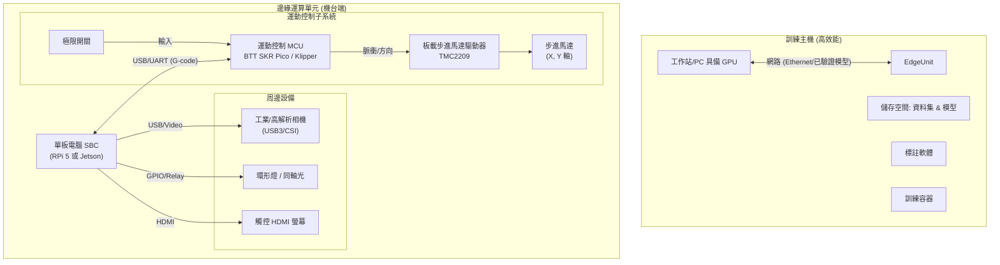
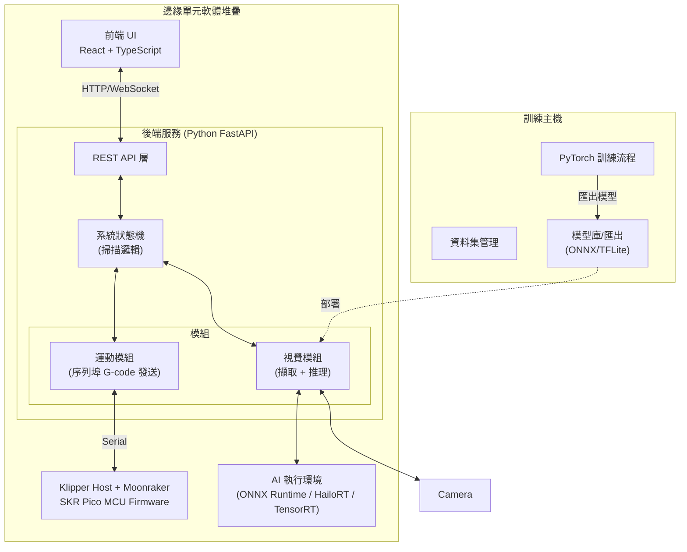

# 低成本 PCB AOI 系統實作計畫與架構

本文件概述了低成本 PCB 自動光學檢測 (AOI) 系統的硬體與軟體架構。

## 需要使用者審查

> [!NOTE]
> **低成本權衡 (Low-Cost Trade-offs):**
> 我們目標是建立一個「低成本」架構。
> - **邊緣運算**: 我們假設使用 **Raspberry Pi 5 (搭配選購的 AI Hailo Kit)** 或 **NVIDIA Jetson Orin Nano**。這些選擇在邊緣 AI 應用上提供了最佳的性價比。
> - **運動控制**: 為了確保即時穩定性，Linux 邊緣裝置將**不會**直接透過 GPIO 驅動馬達。第一版採用 **BTT SKR Pico V1.0 + Klipper**，Raspberry Pi 透過 Moonraker / Klipper host 編排移動，SKR Pico 專注於即時步進脈衝。

## 1. 硬體架構

系統分為兩個實體：**訓練主機 (Training Host)** 與 **邊緣運算單元 (Edge Unit)**。

### 1.1 架構圖



### 1.2 硬體規格建議與版本 (Hardware Specs & Versions)

| 組件 | 推薦型號/版本 | 備註 |
| :--- | :--- | :--- |
| **邊緣運算 SBC** | **Raspberry Pi 5 (4GB)** | OS: Raspberry Pi OS (Bookworm) 64-bit；Edge / 模擬器需以 4GB RAM 為資源上限 |
| **AI 加速器 (選用)** | **Hailo-8L** M.2 Kit | 需搭配 PCIe HAT，算力 13 TOPS |
| **運動控制 MCU** | **BTT SKR Pico V1.0** | Klipper MCU firmware，板載 TMC2209 |
| **相機 (關鍵)** | **Hikrobot MV-CE013-50Gm** | 必須搭配 **低畸變鏡頭** (Low Distortion) |
| **光源 (關鍵)** | **白色同軸光 (Coaxial)** | **金手指異物檢測必備** (消除反光) |
| **光源 (輔助)** | **高角度環形光** | **棕化銅面/軟板成型邊緣** 檢測 |
| **馬達驅動** | **TMC2209** (UART Mode) | 靜音、支援無感歸零 (Sensorless Homing) |
| **機構** | **OpenBuilds V-Slot 2040** | 配合 NEMA 17 步進馬達 (42型) |

---

## 2. 軟體架構

### 2.1 架構圖



### 2.2 軟體技術堆疊

#### 邊緣後端 (Python)
- **Python Runtime**: `3.10` or `3.11` (穩定版)
- **Web 框架**: `FastAPI` (v0.109+) + `Uvicorn`
- **電腦視覺**: `OpenCV-Python` (v4.9+)
- **AI 推理**: `ONNX Runtime` (v1.16+) 或 `HailoRT` (v4.16+)
- **通訊**: `pyserial` (v3.5)

#### Raspberry Pi 5 4GB Memory Budget

因實機採用 Raspberry Pi 5 4GB，Edge 實作與 Windows Edge Simulator 需保持相同的記憶體紀律：

- Backend 啟動只掃描 model registry，不預載全部模型權重。
- Hailo / ONNX adapter 採 active model lazy load；切換模型時釋放前一個 adapter。
- Capture / inference 管線避免複製大型 frame；同一階段只保留必要影像 buffer。
- Review / history API 回傳 metadata 與縮圖路徑，不直接把大量圖片內容塞進單次 response。
- 前端 build 不以 Pi 本機編譯為預設流程，避免 TypeScript / Vite 建置時吃滿 RAM。

#### 邊緣前端 (Web UI)
- **Runtime**: `Node.js` (v20 LTS)
- **框架**: `React` (v18.2+)
- **建置工具**: `Vite` (v5.0+)
- **UI 庫**: `ShadcnUI` (基於 Radix UI & Tailwind CSS v3.4)

#### 訓練主機
- **OS**: Windows 10/11 or Ubuntu 22.04 LTS
- **AI 框架**: `PyTorch` (v2.1+), `Torchvision`
- **物件偵測**: `Ultralytics YOLO11` (Latest Release)
- **CUDA**: v12.1 (若使用 NVIDIA GPU)

### 2.3 使用者介面架構 (UI Architecture)

本系統在 **訓練主機** 與 **邊緣機台** 皆具備視覺化介面 (Web-based)，確保跨平台存取與現代化體驗。

#### A. 邊緣機台介面 (Edge Operator UI)
*專為產線作業員設計，強調直覺、簡單、大按鈕。*

- **操作面板**:
    - [x] **開始/停止/暫停**: 用於控制掃描任務。
    - [x] **即時狀態**: 顯示目前機器座標 (X, Y) 與運行狀態 (Idle, Moving, Capturing)。
    - [x] **即時影像**: 顯示相機即時串流 (低延遲)。
- **檢測結果**:
    - [x] **OK/NG 指示燈**: 醒目的全螢幕紅綠燈號。
    - [x] **缺陷地圖 (Defect Map)**: 在 PCB 縮圖上標記出缺陷位置。
- **工程模式 (權限解鎖)**:
    - [x] **手動 Jog**: 前後左右移動龍門。
    - [x] **參數設定**: 調整馬達速度、相機曝光。

#### B. 訓練主機介面 (Host Training Dashboard)
*專為 AI 工程師設計，管理模型與數據。*

- **資料集管理**:
    - [x] **圖片瀏覽器**: 檢視已上傳的 PCB 影像。
    - [x] **標註工具整合**: 內嵌或連結至 LabelImg/CVAT。
- **訓練任務管理**:
    - [x] **新建訓練**: 選擇資料集、模型架構 (YOLOv8/EfficientNet)、設定超參數。
    - [x] **訓練監控**: 顯示 Loss 曲線、mAP 即時圖表 (整合 TensorBoard 數據)。
- **模型發布**:
    - [x] **模型版本控制**: 比較不同版本的準確率。
    - [x] **一鍵匯出**: 將訓練好的模型轉換為 ONNX 並打包供 Edge 下載。

### 2.4 訓練主機 Docker 架構 (Training Host Docker)

為了簡化部署與環境一致性，訓練主機將採用 **Docker Compose** 部署，包含以下服務：

```yaml
services:
  # 1. 核心訓練後端 & API
  training-backend:
    image: pytorch/pytorch:2.1.0-cuda12.1-cudnn8-runtime
    volumes:
      - ./data:/app/data      # 資料集
      - ./models:/app/models  # 訓練好的模型
      - ./src:/app/src        # 程式碼
    ports:
      - "8000:8000"           # API Port
    command: uvicorn app.main:app --host 0.0.0.0 --reload

  # 2. 訓練儀表板前端
  training-frontend:
    build: ./frontend
    ports:
      - "3000:80"             # Web UI Port (Nginx)
    depends_on:
      - training-backend

  # 3. 任務佇列 (Redis) - 用於非同步訓練任務
  redis:
    image: redis:alpine

  # 4. 可視化 (TensorBoard)
  tensorboard:
    image: tensorflow/tensorflow:latest
    volumes:
      - ./runs:/tensorboard_logs
    ports:
      - "6006:6006"
    command: tensorboard --logdir=/tensorboard_logs --bind_all
```

## 3. 分階段實作策略 (Phased Implementation Strategy)

依據專案規劃，系統將分為四個階段逐步構建：

### Phase 1: 專案架構規劃、介面撰寫與 YOLO 訓練環境
- **重點**: 建立專案架構、完成主要操作介面雛形，並架設 YOLO 訓練環境。
- **作法**: 規劃 `training-host/`、`windows-edge-simulator/`、`raspberry-pi/` 的責任邊界，完成訓練端與 Edge 操作端 UI/API 雛形。
- **產出**: 可啟動的訓練環境、基礎介面流程、資料與模型交換契約。

### Phase 2: Raspberry Pi 截圖部署
- **重點**: 實際部署 Raspberry Pi，先完成無移動架構、無邊緣運算的 Capture 核心流程。
- **流程**:
    1. 將後端與前端部署到 Raspberry Pi。
    2. 連接相機並完成基本拍照/存檔。
    3. 前端提供 SNAP / 截圖操作與結果檢視。
    4. 建立截圖結果清單，記錄截圖時間、圖片檔名、使用模型、模型辨識結果與人工判定結果。
    5. 提供模型選擇欄位，預設不選擇任何模型；本階段不執行模型辨識。
    6. 支援人工填寫或修改 OK / NG，作為本階段最終判定。
    7. Capture 主畫面以相機畫面為主要區域，右側結果清單未展開時只顯示圖片名稱、模型名稱與 YOLO OK / NG。
    8. 結果清單可放大為彈窗，放大後可操作人工 OK / NG、查看 Export 狀態與完整欄位。
    9. 截圖詳細資料窗格需提供上一張 / 下一張，支援快速切換資料並連續覆判。
    10. 點擊人工 OK / NG 只更新覆判結果，不自動開啟詳細資料窗格；只有點擊圖片檢視入口才開啟詳細資料。
    11. 詳細資料窗格需固定主要區塊高度，切換 OK / NG 或辨識錯誤標示時不造成窗格跳動。
    12. 詳細資料窗格支援修改 PART / BATCH；本階段先同步更新紀錄，後續再延伸為同步修改檔名。
    13. 預留辨識錯誤欄位與資料結構，供 Phase 3 啟用模型辨識後使用。
    14. 提供清除清單功能，只清除 Capture Result List，不刪除圖片檔案。
    15. 提供 Export UI，顯示摘要與資料明細，並下載可透過 USB 搬移至 Training Host 的匯入 ZIP。
    16. Export ZIP 需包含 `manifest.json`、`report.json`、`program.json` 與 `images/`，資料格式需符合 Training Host `import-run` 匯入流程。
- **硬體**: Raspberry Pi + 相機，不導入移動平台與 AI 邊緣推理。

### Phase 3: Raspberry Pi 截圖 + 邊緣辨識流程
- **重點**: 在 Raspberry Pi 上導入邊緣運算，完成截圖後的模型辨識流程，但仍不導入移動架構。
- **流程**:
    1. 載入已訓練模型或 Hailo 模型包。
    2. 執行截圖。
    3. 將影像送入邊緣推理流程。
    4. 回傳 OK / NG 與缺陷資訊到前端。
    5. 若人工判定與模型原始判定不同，標註為辨識錯誤並保留資料供模型再訓練。
    6. 已截圖資料可重新指定模型；模型變更後重新推論該圖片，並更新 YOLO OK / NG、缺陷資訊與辨識錯誤狀態。

### Phase 4: Raspberry Pi 移動架構整合
- **重點**: 實際部署 Raspberry Pi 並導入移動架構，完成自動化掃描流程。
- **流程**:
    1. 連接運動控制器與移動平台。
    2. 載入掃描路徑或檢測程式。
    3. 執行「移動 -> 截圖 -> 辨識 -> 記錄」流程。
- **項目**: 移動控制穩定性、掃描流程整合、長時間運作測試與模型迭代資料回收。

## 4. AI 視覺辨識與訓練流程 (AI Vision Pipeline)

### 4.1 訓練策略 (Training Host)

我們採用 **遷移學習 (Transfer Learning)** 來降低對大量數據的需求。

1.  **資料準備 (Data Preparation)**:
    - **黃金樣本 (Golden Sample)**: 拍攝「良品」PCB，利用影像對齊技術 (Image Registration) 建立基準。
    - **缺陷合成 (Defect Synthesis)**: (選用) 在良品影像上數位合成常見缺陷 (短路、斷路、少錫)，增加負樣本數量。
    - **資料增強 (Augmentation)**: 旋轉、亮度調整、雜訊添加，模擬工廠光線變化。
2.  **模型訓練流程 (針對軟硬結合板)**:
    -   **缺陷定義 (Defect Classes)**:
        -   `fm_on_gold`: **金手指表面異物** (同軸光下為黑點)。
        -   `fm_in_gap`: **金手指間距異物** (短路風險)。
        -   `oxidized_surface_scratch`: **內層棕化面刮傷**。
        -   `edge_burr`: **軟板成形毛邊**。
        -   `edge_tear`: **軟板撕裂/缺角**。
    -   **單階段檢測 (建議)**:
        -   直接使用 **YOLO11** 進行物件偵測。
3.  **模型匯出**:
    - 訓練完成後，將 PyTorch權重 (.pt) 轉換為 **ONNX** 格式。
    - 針對 Edge 硬體進行量化 (Quantization, FP16/INT8) 以提升 FPS。

### 4.2 邊緣辨識邏輯 (Edge Inference Logic)

當相機觸發並取得影像後，執行以下 Pipeline：

```python
def inference_pipeline(image, model):
    # 1. 預處理 (Preprocessing)
    # 裁切 ROI (若有), 縮放至 640x640, 正規化 (0-1)
    input_tensor = preprocess(image)
    
    # 2. 推理 (Inference)
    # 運行 ONNX Runtime Session
    outputs = model.run(input_tensor)
    
    # 3. 後處理 (Post-processing)
    # 非極大值抑制 (NMS) 過濾重疊框
    # 信心度閾值過濾 (Confidence Threshold > 0.5)
    detections = post_process(outputs)
    
    # 4. 座標映射 (Coordinate Mapping)
    # 將 640x640 圖像座標轉換回 PCB 實際物理座標 (mm)
    global_defects = map_to_global(detections, current_gantry_pos)
    
    return global_defects
```

## 5. 建議資料夾結構

```text
low-cost-aoi/
├── training-host/              # Windows 本地訓練終端
│   ├── backend/
│   ├── frontend/
│   └── docker-compose.yml
├── windows-edge-simulator/     # Windows Docker Edge 模擬
│   ├── edge-backend/           # FastAPI Edge backend 模擬
│   ├── edge-frontend/          # React Edge UI 模擬
│   └── docker-compose.edge.yml
├── raspberry-pi/               # Raspberry Pi 實機部署版本
│   ├── backend/                # systemd 部署、Hailo model loader
│   └── frontend/               # Nginx 原生部署
└── shared/contracts/           # Edge/Training/Pi 共用資料契約
```

## 6. Gap Analysis: 與商用 AOI 系統之差距分析

相比於市售價格百萬級的商用 AOI (如 Omron, Test Research Inc, Saki)，本「低成本方案」存在以下顯著差距與取捨：

| 特性 | 本專案 (低成本架構) | 商用專業 AOI | 差距影響 / 改善方向 |
| :--- | :--- | :--- | :--- |
| **光源系統** | **單色環形燈/同軸光** | **多角度 RGB 彩色光源** (塔狀光) | 無法利用色差判別 3D 焊錫爬升角度 (Solder Fillet)。<br>**改善**: 未來可升級可程式化 RGB LED 環。 |
| **運動精度** | **步進馬達 (Open Loop)** | **線性馬達 + 光學尺 (Closed Loop)** | 重複精度約 0.05~0.1mm vs 1um。<br>**影響**: 對 0201 以下極小元件檢測能力受限。 |
| **編程方式** | **Teaching (手動教導) / 簡易掃描** | **CAD/Gerber 匯入自動生成** | 換線速度慢。商用機可直接讀 PCB 原始檔產生檢測點。<br>**改善**: 開發 Gerber 解析模組 (Phase 4.5)。 |
| **鏡頭光學** | **標準 C-Mount FA 鏡頭** | **遠心鏡頭 (Telecentric Lens)** | 普通鏡頭邊緣有視差 (Parallax)，高元件側面會被誤判。<br>**改善**: 若檢測高元件，需軟體校正或換遠心鏡頭。 |
| **深度檢測** | **2D 影像 + AI** | **3D 結構光 / 雲紋干涉 (Moiré)** | 無法檢測元件浮高 (Lift) 或 IC 腳翹起，除非影子很明顯。 |
| **系統整合** | **單機作業 + 內網 API** | **SMEMA / MES 整合** | 無法與產線上下游 (Loader/Unloader, SMT) 自動連線通訊。 |
| **資料分析** | **基本缺點紀錄** | **SPC (統計製程管制)** | 缺乏 CPK/Yield Rate 長期趨勢分析工具。 |

### 6.1 尚未包含的功能 (Missing Features Scope)

為了控制成本與開發時程，以下功能**暫不列入**第一版範圍：
1.  **Gerber/CAD 匯入**: 目前依賴手動設定掃描區域或影像教導。
2.  **條碼讀取 (Barcode/DataMatrix)**: 未實作自動讀取 PCB 序號 (可透過軟體擴充)。
3.  **自動寬度調整 (Conveyor Width)**: 機構為固定式或手動調整。
4.  **離線編程 (Offline Programming)**: 需在實機上訓練/設定。

---

## 7. 2026-05-29 實作計畫補充

### 7.1 Training Host 訓練 UI 自動化

目前 YOLO11 smoke model 訓練已透過 PowerShell 指令跑通，但此流程尚未產品化。

下一步需在 Training Host 建立訓練 UI：

```text
選資料集 -> 選 base model -> 設定訓練參數 -> 啟動訓練 -> 查看 log/進度 -> 選 best.pt -> 產生 model bundle
```

必要欄位：

- dataset path / dataset id。
- base model，例如 `yolo11n.pt`。
- epochs。
- imgsz。
- batch。
- project。
- run name。

### 7.2 Dataset 品質門檻

目前 YOLO v1 流程已跑通，但在模擬輪播圖片上辨識效果不足。

後續每次訓練前應檢查：

- OK 圖數量。
- 毛絲圖數量。
- 殘肉圖數量。
- 訓練圖與實際檢測圖的倍率、光源、角度、背景一致性。

初步目標：

```text
每類缺陷至少 30-50 張作 smoke retrain
每類缺陷 100-300 張後再期待穩定表現
```

### 7.3 Windows Edge Simulator 開發輔助功能邊界

以下功能只保留在 Windows Edge Simulator：

- `sim-camera` 圖片輪播。
- 本機 Ollama VLM 輔助判讀。

Raspberry Pi production deployment 時需移除或關閉。

### 7.4 Windows Webcam 修正方向

目前 Docker backend 無法直接接入 Windows webcam。後續若要在 Windows 開發機驗證實體 webcam，優先新增：

```text
Windows local backend 啟動模式
```

以本機 Python / OpenCV 執行：

```python
cv2.VideoCapture(0)
```

再讓 frontend 指向本機 backend API。
