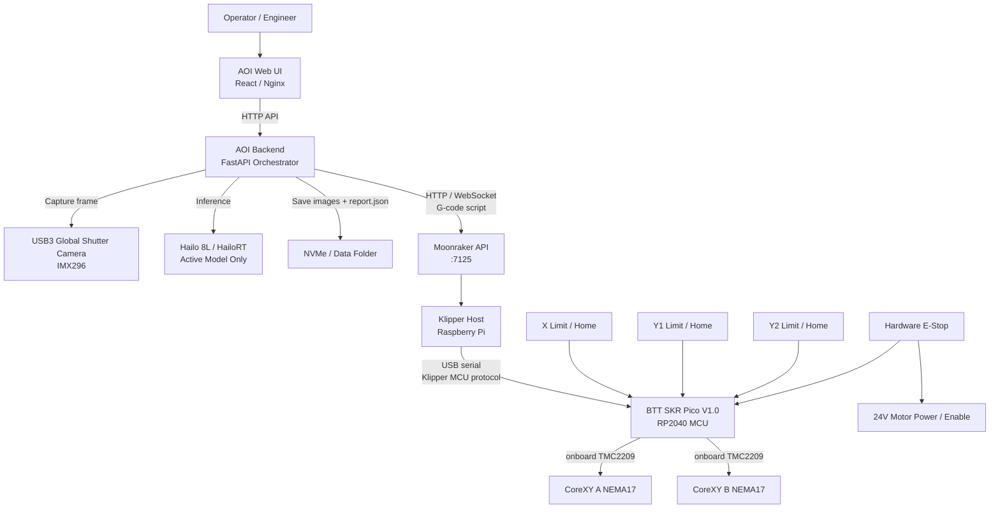
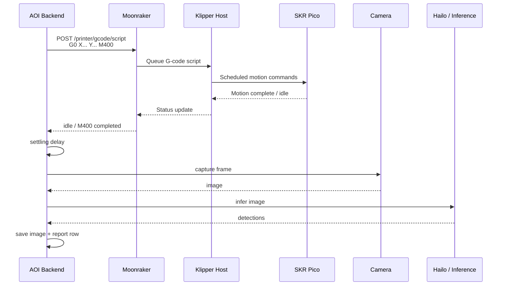

# SKR Pico / Klipper AOI 下位機架構

> 日期: 2026-05-31  
> 決策: 第一版下位機採用 **BTT SKR Pico V1.0 + Klipper / Moonraker**。ESP32 / FluidNC 保留為備案研究，不作為第一版主線。

## 1. 架構定位

SKR Pico 不負責 AOI 的相機、推論或資料記錄。它只作為即時運動控制 MCU，負責接收 Klipper host 排程後的低階運動命令，輸出步進馬達脈衝。

Raspberry Pi 5 4GB 同時執行：

- AOI backend: 相機、拍照、推論、結果儲存、掃描流程編排。
- Klipper host: 運動學計算、step scheduling、與 SKR Pico MCU 通訊。
- Moonraker: 提供 HTTP / WebSocket API，讓 AOI backend 可以呼叫 Klipper。
- Nginx / frontend: 操作介面靜態檔。

## 2. 完整架構圖



## 3. Raspberry Pi 與 SKR Pico 如何溝通

### 3.1 實體連線

```text
Raspberry Pi 5 USB-A
  -> USB cable
  -> SKR Pico USB-C
  -> Klipper MCU firmware on RP2040
```

此 USB 不是一般 GRBL/FluidNC 的純文字 G-code serial。Klipper 採用自己的 host-to-MCU protocol。AOI 程式不應直接對 SKR Pico USB port 寫 G-code，而是透過 Moonraker / Klipper host 發送移動命令。

### 3.2 軟體呼叫路徑

```text
AOI backend
  -> Moonraker HTTP API
  -> Klipper host
  -> Klipper MCU protocol over USB
  -> SKR Pico
  -> TMC2209 / motors
```

AOI backend 送出的仍可是一小段 G-code script，例如:

```text
G90
G0 X120.000 Y80.000 F3000
M400
```

但這段 G-code 是給 Klipper host 處理，不是直接丟給 SKR Pico。

## 4. AOI 與一般 Klipper 列印流程的差異

一般 3D 列印:

```text
讀取完整 G-code 檔案 -> Klipper 持續執行 -> 印完
```

AOI 掃描:

```text
移動到檢測點
等待移動完成
等待龍門震動衰減
拍照
推論
儲存結果
再移動下一個點
```

因此 AOI 不應把整段掃描當成傳統列印檔一次丟給 Klipper。建議由 AOI backend 作為 orchestrator，逐點控制。



## 5. AOI Backend 程式略寫法

```python
import time
import requests

MOONRAKER_URL = "http://127.0.0.1:7125"


class KlipperMotion:
    def __init__(self, base_url: str = MOONRAKER_URL):
        self.base_url = base_url.rstrip("/")

    def gcode(self, script: str) -> None:
        response = requests.post(
            f"{self.base_url}/printer/gcode/script",
            json={"script": script},
            timeout=30,
        )
        response.raise_for_status()

    def home(self) -> None:
        self.gcode("G28")

    def move_to(self, x: float, y: float, feed: int = 3000) -> None:
        self.gcode(f"G90\nG0 X{x:.3f} Y{y:.3f} F{feed}\nM400")


def inspect_point(motion: KlipperMotion, camera, inference, x: float, y: float):
    motion.move_to(x, y)
    time.sleep(0.15)

    image = camera.capture()
    detections = inference.predict(image)

    return {
        "x": x,
        "y": y,
        "detections": detections,
    }
```

實作時可再加上:

- 查詢 `print_stats.state` 或 `toolhead.position` 確認狀態。
- 移動 timeout。
- Emergency stop API。
- 與 orchestrator state machine 整合。

## 6. SKR Pico 與馬達 / 限位接線

SKR Pico 已內建 TMC2209 driver，第一版 AOI 不需外接 stepstick driver。

建議配置:

| 功能 | SKR Pico 端 | 說明 |
|:---|:---|:---|
| A Motor | X motor output | CoreXY A motor，NEMA17 + GT2 20T pulley |
| B Motor | Y motor output | CoreXY B motor，NEMA17 + GT2 20T pulley |
| X Endstop | X stop input | X homing |
| Y1 Endstop | Y stop input | Y 左側 homing |
| Y2 Endstop | Z stop 或 spare input | Y 右側 homing / gantry squaring |
| 24V IN | Power input | 馬達與板載電源 |
| USB-C | Pi USB | Klipper MCU communication |

馬達線:

```text
SKR Pico motor port
  -> A1 / A2 / B1 / B2
  -> NEMA17 two coils
```

限位開關建議使用 NC:

```text
Endstop signal
  -> NC switch
  -> GND
```

急停建議採硬體切斷 24V motor power 或 driver enable，不只依賴軟體 `M112`。

## 7. Klipper printer.cfg 略寫方向

此範例只表示結構，實際 pin name 需依 SKR Pico 官方 pinout 校對。

```ini
[mcu]
serial: /dev/serial/by-id/usb-Klipper_rp2040_...

[printer]
kinematics: corexy
max_velocity: 150
max_accel: 800

[stepper_x]
step_pin: gpio...
dir_pin: gpio...
enable_pin: !gpio...
microsteps: 16
rotation_distance: 40
endstop_pin: ^gpio...
position_endstop: 0
position_min: 0
position_max: 600
homing_speed: 30

[stepper_y]
step_pin: gpio...
dir_pin: gpio...
enable_pin: !gpio...
microsteps: 16
rotation_distance: 40
endstop_pin: ^gpio...
position_endstop: 0
position_min: 0
position_max: 800
homing_speed: 30

```

GT2 20T pulley 的 `rotation_distance`:

```text
20 teeth * 2mm pitch = 40mm/rev
rotation_distance = 40
```

## 8. 對 Raspberry Pi 5 4GB 的負荷判斷

此方案對 Pi 5 4GB 可行，因為即時馬達脈衝由 SKR Pico 執行，Pi 不直接 bit-bang GPIO。

Pi 常駐項目:

| 服務 | 負荷 |
|:---|:---|
| Klipper host | 低 |
| Moonraker | 低 |
| FastAPI AOI backend | 中低 |
| Nginx 靜態前端 | 低 |
| Camera capture / OpenCV 單張處理 | 中 |
| HailoRT 推論 | 中，主要由 Hailo 8L 加速 |

限制:

- 不在 Pi 上訓練模型。
- 不在 Pi 上常態執行 frontend build。
- 不一次載入多個模型。
- 不一次讀取大量歷史圖片。
- Capture / inference 只保留必要 frame buffer。

## 9. 龍門尺寸與 SKR Pico 驅動能力

目前龍門有效量測範圍分為兩個候選:

| 方案 | 有效量測範圍 | 對 SKR Pico / TMC2209 的影響 |
|:---|:---:|:---|
| 方案一 | 620 x 550 mm | 可行但偏重，長 GT2 9mm 皮帶需保守速度/加速度、Input Shaping 與張力控制 |
| 方案二 | 320 x 300 mm | 第一版指定採用，CoreXY 皮帶較短，重量、慣量與震動都較低 |

第一版建議採用 **方案二 320 x 300mm** 作為驗證機。若後續放大到 620 x 550mm，需重新評估:

- X 橫樑重量與撓曲。
- CoreXY A/B belt path、張力一致性與 idler 共面。
- 移動後回彈、共振與 Input Shaping 效果。
- TMC2209 溫度與失步風險。
- 移動後 settling delay。
- ADXL345 量測到的震動峰值。

詳見 `gantry_size_weight_options.md`。

## 10. 決策紀錄

第一版 AOI 下位機正式採用:

```text
BTT SKR Pico V1.0
Klipper host on Raspberry Pi 5 4GB
Moonraker API for AOI backend motion control
```

ESP32 / FluidNC 保留為研究備案，適合後續需要更 CNC 化或 Wi-Fi 獨立控制時再評估。
