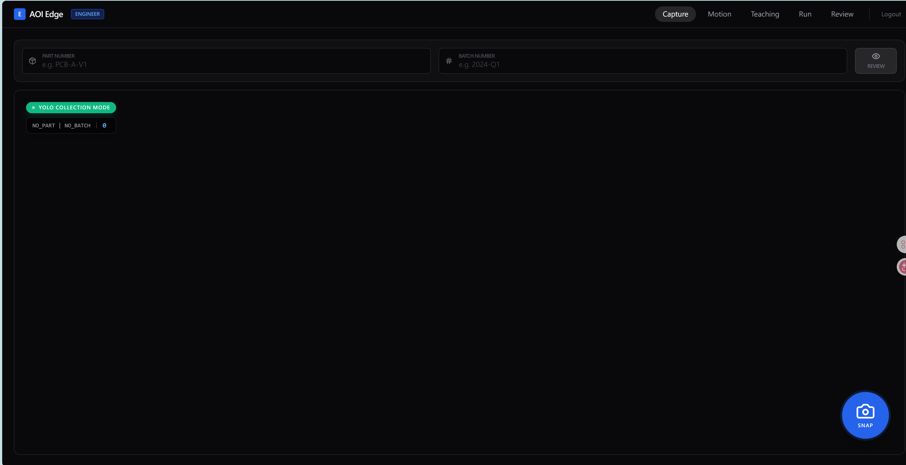

# Capture模式 優化功能

## 功能目標
建立以 **Capture 模式** 為核心的 AOI 操作流程，讓使用者可在截圖後直接完成 YOLO 模型辨識、結果檢視、人工覆判與後續訓練資料回收。

## 介面優化項目
1. **新增模型載入框**  
   - 在 Capture 畫面提供模型下拉選單。  
   - 可選擇本機已訓練完成的 YOLO 模型。  
   - 預設為**不選擇任何模型**（即關閉自動辨識）。  
   - 建議顯示模型名稱、版本或最後更新時間，方便辨識。

2. **截圖後依模型選擇決定行為**  
   - **有選擇模型時**：按下 **SNAP / 截圖按鈕** 後，系統儲存圖片，自動送至所選 YOLO 模型進行辨識，即時回傳 **OK / NG**。  
   - **未選擇模型時**：按下 **SNAP / 截圖按鈕** 後，僅儲存圖片，**略過模型辨識**，由使用者自行在清單中手動記錄 **OK / NG**。  
   - 兩種模式的操作流程應流暢一致，不因有無模型而影響截圖體驗。

3. **建立截圖結果清單**  
   - 所有截圖檔案需自動整理至結果清單中。  
   - Capture 主畫面需讓相機畫面佔主要區域；右側結果清單未展開時只顯示圖片名稱、使用模型與 YOLO OK / NG。  
   - 結果清單需支援放大彈窗，放大後才顯示完整欄位與人工覆判操作。  
   - 清單中需顯示至少以下資訊：
     - 截圖時間
     - 圖片檔名
     - 使用模型（若未選擇則顯示「—」或「無」）
     - 模型辨識結果（OK / NG / 無）
     - 人工判定結果（OK / NG，由使用者手動填寫）
   - 支援點選圖片檢視入口後檢視對應圖片；點擊 OK / NG 不應自動開啟詳細資料。  
   - 截圖詳細資料窗格需提供上一張 / 下一張按鈕，支援快速切換資料與連續覆判。  
   - 截圖詳細資料窗格需維持固定高度，切換 OK / NG 或辨識錯誤顯示時不得造成高度跳動。  
   - 截圖詳細資料窗格需支援修改 PART / BATCH；目前先同步修改紀錄，後續可延伸為同步修改檔名。

4. **支援人工修改辨識結果**  
   - 使用者可於清單中手動修改判定結果為 **OK / NG**。  
   - **若有使用模型辨識**，且人工結果與模型原始判定不同，系統需額外標註為 **辨識錯誤**。  
   - **若未使用模型辨識**，人工結果即為最終判定，不需標註辨識錯誤。  
   - 辨識錯誤的資料需保留，供後續回到本機訓練端時進行再學習或模型優化。
   - 截圖詳細資料窗格需支援重新指定模型；模型變更後系統需重新將該圖片送入對應模型檢驗，並更新 YOLO OK / NG、缺陷資訊與辨識錯誤狀態。

5. **作為後續功能基礎模式**  
   - 後續相關功能皆以這套 **Capture 模式** 為基礎進行擴充。  
   - 包含但不限於：資料蒐集、結果回查、人工標註、模型迭代訓練。

## 建議補充
- 可加入清單篩選功能，例如依 **OK / NG / 辨識錯誤** 篩選。
- 可預留匯出功能，將人工修正結果輸出為訓練資料格式。
- 若需提升操作效率，可支援最新一筆截圖結果高亮顯示。
