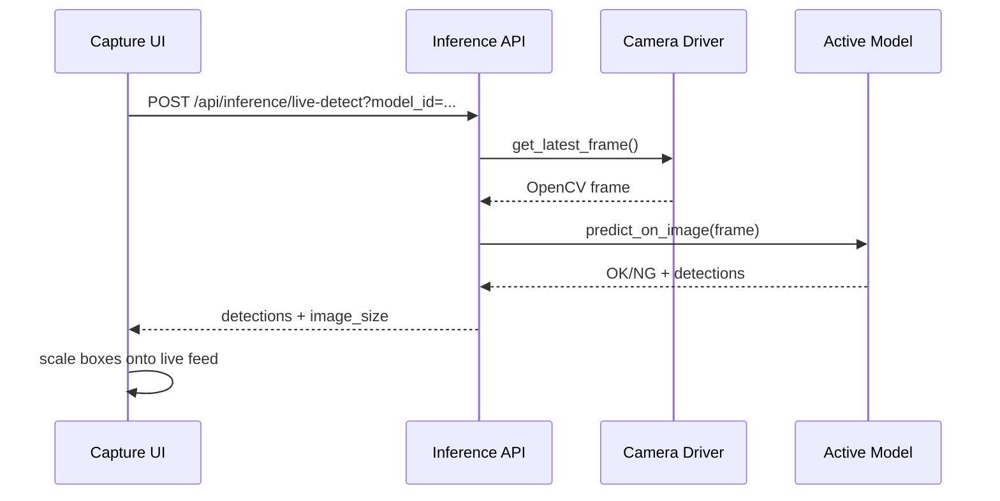

# Capture 即時辨識設計

## 目標

在 Capture 頁面加入模型辨識控制，讓操作員不需要先截圖或存圖，就能直接用目前相機畫面進行辨識。

Capture 頁面新增兩個動作：

- `Live Detect`：開關式功能。開啟後會週期性取目前相機畫面送模型推論，並在 live feed 上疊加缺陷框與辨識度。
- `Detect Once`：按鈕式功能。按一次只辨識當下相機畫面，不存圖片，也不新增 Capture 紀錄。

既有 `SNAP` 行為不變：它仍會拍照存檔、加入 Capture list，並在有啟用模型時把模型結果寫入該筆紀錄。

## 範圍

包含：

- Raspberry Pi Capture UI。
- Raspberry Pi backend inference API。
- Windows Edge Simulator 對齊相同前後端路徑。
- 在 live feed 上顯示 label、confidence 與像素座標框。
- 沒有可用模型或推論被鎖定時，顯示清楚的 disabled/error 狀態。

不包含：

- 連續錄影。
- 儲存 live-detect 使用的畫面。
- 將 live-detect-only 結果匯出到 Training Host。
- 修改 Hailo 後處理邏輯；只沿用既有 `predict_on_image` contract。
- 新增模型 threshold 設定。

## 建議方案

新增一個 inference endpoint，直接從 camera driver 取最新畫面：

`POST /api/inference/live-detect`

Request 參數：

- `model_id`：選定模型 id。除非 `part_no` 能找到 active model，否則必填。
- `part_no`：選填，用來 fallback 查找該料號的 active model。

Response 格式：

```json
{
  "status": "success",
  "result": "OK",
  "detections": [
    {
      "label": "defect",
      "confidence": 0.91,
      "box": [120, 80, 64, 42]
    }
  ],
  "image_size": {
    "width": 1920,
    "height": 1080
  },
  "model_id": "PCB-A001-yolo-v1",
  "captured_at": "2026-06-11T23:00:00+08:00"
}
```

此 endpoint 不寫入圖片檔，也不建立 Capture record。

## 後端設計

把 `live-detect` 加在既有 inference router，因為這是辨識動作，不是 Capture 資料保存動作。

流程：

1. 透過既有 `ActiveModelManager` 驗證選定模型。
2. 透過 `camera.get_latest_frame()` 取得目前相機 frame。
3. 執行 `inference.predict_on_image(frame, model_id=model_id, part_no=part_no)`。
4. 回傳 OK/NG、detections、影像尺寸、模型 id 與時間戳。

錯誤行為：

- `AOI_EDGE_MODEL_INFERENCE_ENABLED=false` 鎖定推論時，回傳 HTTP 423。
- 沒有選定模型，也找不到 active model 時，回傳 HTTP 400。
- 模型包無效或 runtime 不可用時，回傳 HTTP 503。
- Hailo 執行或後處理尚未接線時，回傳 HTTP 501。
- Camera 無法回傳 frame 時，回傳 HTTP 500。

Detection contract 沿用現有格式：`box` 是來源影像像素座標 `[x, y, w, h]`。

## 前端設計

在 `CaptureView` 的模型選擇與 live camera 區域附近新增兩個控制：

- `Live Detect` toggle。
- `Detect Once` button。

狀態：

- `liveDetectEnabled`：是否正在週期性辨識。
- `isDetectingOnce`：是否正在執行單次辨識。
- `liveDetectResult`：最新 live detect 回應。
- `liveDetectError`：最新可顯示錯誤。

輪詢行為：

- `Live Detect` 開啟時，每 800-1200 ms 呼叫 `/api/inference/live-detect`。
- 上一個 request 尚未完成時，不送出新的 request。
- toggle 關閉、component unmount、或選到不可用模型時停止輪詢。
- 開啟期間保留最新框，直到下一次結果取代；關閉時清除 live detect 疊圖。

疊框行為：

- 在既有 live feed container 上方繪製 detection boxes。
- 使用 response 的 `image_size` 與 live image container 尺寸，把來源像素座標轉成顯示座標。
- 必須保留目前 `object-contain` 顯示行為，包含上下或左右留黑邊時的 offset。
- 每個框顯示 label 與 confidence 百分比。
- `OK` 結果不顯示框，顯示簡短 `OK / No match` 狀態。
- `NG` 結果顯示所有回傳框。

控制行為：

- `Detect Once` 在 `Live Detect` 開啟或關閉時都可使用。
- 若 `Detect Once` 按下時已有 live request 進行中，前端共用同一個 request guard，避免重疊呼叫。
- `SNAP` 與 live detect 彼此獨立，仍照原本流程保存到 Capture list。
- 沒有選到 enabled model 時，兩個辨識控制都 disabled，並顯示模型路徑不可用。

## 資料流



## 測試

後端測試：

- `live-detect` 回傳 detections 與 image size，且不寫入 capture records。
- 推論鎖定時回傳 423。
- 缺少模型選擇時回傳 400。
- camera frame 失敗時回傳 500。

前端測試或重點驗證：

- `Detect Once` 可根據 API response 顯示框與 confidence。
- `Live Detect` 可開始與停止輪詢。
- 輪詢不會重疊 request。
- 疊框縮放能處理 `object-contain` 造成的黑邊。
- 選定模型不可用時顯示 disabled 狀態。

手動驗證：

- 啟動 edge backend/frontend。
- 選擇 enabled model。
- 按 `Detect Once`，確認畫面顯示結果，但 Capture Result List 不新增資料列。
- 開啟 `Live Detect`，確認 live feed 上的框會更新。
- 關閉 `Live Detect`，確認輪詢停止且 UI 回到 idle。
- 按 `SNAP`，確認既有保存到 Capture list 的行為仍正常。

## 驗收條件

- 操作員可以在 Capture 頁面不存圖直接執行模型辨識。
- 操作員可以開關連續即時辨識。
- 操作員可以執行單次辨識，且不寫入 Capture record。
- 偵測到缺陷時，camera preview 會顯示辨識框與 confidence。
- 既有 Capture list、人工 OK/NG、export 與 `SNAP` 工作流維持正常。
