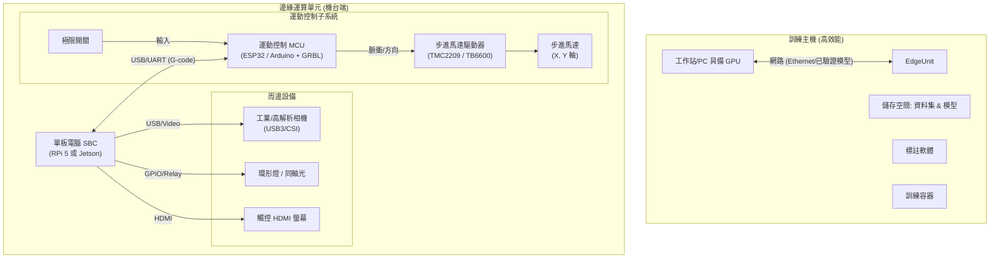
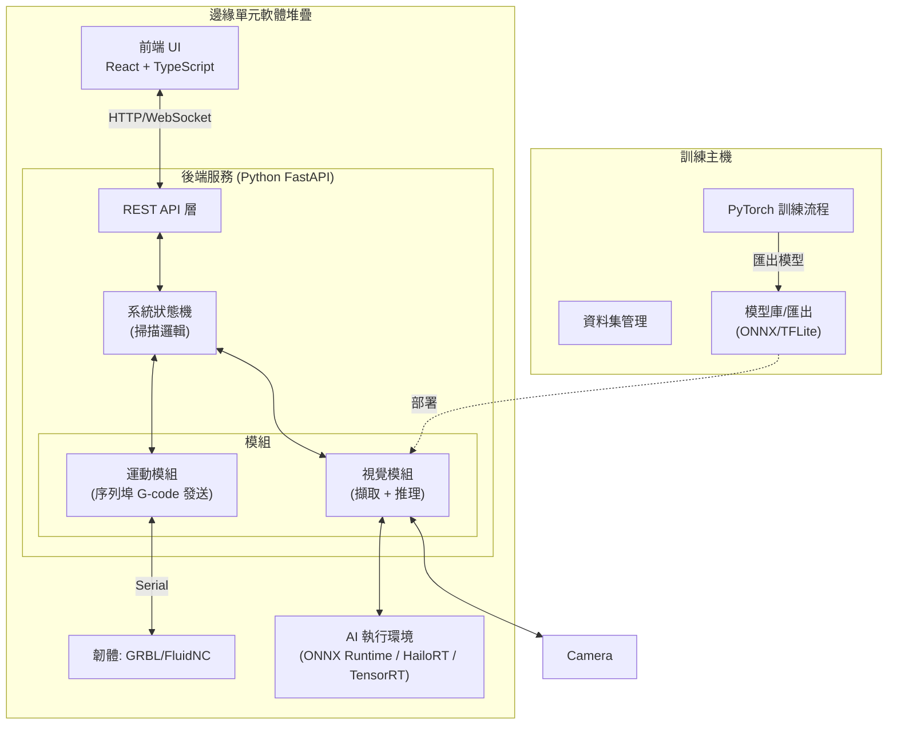

# 低成本 PCB AOI 系統實作計畫與架構

本文件概述了低成本 PCB 自動光學檢測 (AOI) 系統的硬體與軟體架構。

## 需要使用者審查

> [!NOTE]
> **低成本權衡 (Low-Cost Trade-offs):**
> 我們目標是建立一個「低成本」架構。
> - **邊緣運算**: 我們假設使用 **Raspberry Pi 5 (搭配選購的 AI Hailo Kit)** 或 **NVIDIA Jetson Orin Nano**。這些選擇在邊緣 AI 應用上提供了最佳的性價比。
> - **運動控制**: 為了確保即時穩定性，Linux 邊緣裝置將**不會**直接透過 GPIO 驅動馬達。相反，它將透過 USB/Serial 與專用的 **MCU (ESP32 或 Arduino)** 通訊，該 MCU 運行 G-code 韌體 (如 GRBL 或 FluidNC)。

## 1. 硬體架構

系統分為兩個實體：**訓練主機 (Training Host)** 與 **邊緣運算單元 (Edge Unit)**。

### 1.1 架構圖



### 1.2 硬體規格建議與版本 (Hardware Specs & Versions)

| 組件 | 推薦型號/版本 | 備註 |
| :--- | :--- | :--- |
| **邊緣運算 SBC** | **Raspberry Pi 5 (8GB)** | OS: Raspberry Pi OS (Bookworm) 64-bit |
| **AI 加速器 (選用)** | **Hailo-8L** M.2 Kit | 需搭配 PCIe HAT，算力 13 TOPS |
| **運動控制 MCU** | **ESP32-WROOM-32** DevKit V1 | Firmware: **FluidNC v3.7.8+** |
| **相機 (關鍵)** | **Hikrobot MV-CE013-50Gm** | 必須搭配 **低畸變鏡頭** (Low Distortion) |
| **光源 (關鍵)** | **白色同軸光 (Coaxial)** | **金手指異物檢測必備** (消除反光) |
| **光源 (輔助)** | **高角度環形光** | **棕化銅面/軟板成型邊緣** 檢測 |
| **馬達驅動** | **TMC2209** (UART Mode) | 靜音、支援無感歸零 (Sensorless Homing) |
| **機構** | **OpenBuilds V-Slot 2040** | 配合 NEMA 17 步進馬達 (42型) |

---

## 2. 軟體架構

### 2.1 架構圖



### 2.2 軟體技術堆疊

#### 邊緣後端 (Python)
- **Python Runtime**: `3.10` or `3.11` (穩定版)
- **Web 框架**: `FastAPI` (v0.109+) + `Uvicorn`
- **電腦視覺**: `OpenCV-Python` (v4.9+)
- **AI 推理**: `ONNX Runtime` (v1.16+) 或 `HailoRT` (v4.16+)
- **通訊**: `pyserial` (v3.5)

#### 邊緣前端 (Web UI)
- **Runtime**: `Node.js` (v20 LTS)
- **框架**: `React` (v18.2+)
- **建置工具**: `Vite` (v5.0+)
- **UI 庫**: `ShadcnUI` (基於 Radix UI & Tailwind CSS v3.4)

#### 訓練主機
- **OS**: Windows 10/11 or Ubuntu 22.04 LTS
- **AI 框架**: `PyTorch` (v2.1+), `Torchvision`
- **物件偵測**: `Ultralytics YOLO11` (Latest Release)
- **CUDA**: v12.1 (若使用 NVIDIA GPU)

### 2.3 使用者介面架構 (UI Architecture)

本系統在 **訓練主機** 與 **邊緣機台** 皆具備視覺化介面 (Web-based)，確保跨平台存取與現代化體驗。

#### A. 邊緣機台介面 (Edge Operator UI)
*專為產線作業員設計，強調直覺、簡單、大按鈕。*

- **操作面板**:
    - [x] **開始/停止/暫停**: 用於控制掃描任務。
    - [x] **即時狀態**: 顯示目前機器座標 (X, Y) 與運行狀態 (Idle, Moving, Capturing)。
    - [x] **即時影像**: 顯示相機即時串流 (低延遲)。
- **檢測結果**:
    - [x] **OK/NG 指示燈**: 醒目的全螢幕紅綠燈號。
    - [x] **缺陷地圖 (Defect Map)**: 在 PCB 縮圖上標記出缺陷位置。
- **工程模式 (權限解鎖)**:
    - [x] **手動 Jog**: 前後左右移動龍門。
    - [x] **參數設定**: 調整馬達速度、相機曝光。

#### B. 訓練主機介面 (Host Training Dashboard)
*專為 AI 工程師設計，管理模型與數據。*

- **資料集管理**:
    - [x] **圖片瀏覽器**: 檢視已上傳的 PCB 影像。
    - [x] **標註工具整合**: 內嵌或連結至 LabelImg/CVAT。
- **訓練任務管理**:
    - [x] **新建訓練**: 選擇資料集、模型架構 (YOLOv8/EfficientNet)、設定超參數。
    - [x] **訓練監控**: 顯示 Loss 曲線、mAP 即時圖表 (整合 TensorBoard 數據)。
- **模型發布**:
    - [x] **模型版本控制**: 比較不同版本的準確率。
    - [x] **一鍵匯出**: 將訓練好的模型轉換為 ONNX 並打包供 Edge 下載。

### 2.4 訓練主機 Docker 架構 (Training Host Docker)

為了簡化部署與環境一致性，訓練主機將採用 **Docker Compose** 部署，包含以下服務：

```yaml
services:
  # 1. 核心訓練後端 & API
  training-backend:
    image: pytorch/pytorch:2.1.0-cuda12.1-cudnn8-runtime
    volumes:
      - ./data:/app/data      # 資料集
      - ./models:/app/models  # 訓練好的模型
      - ./src:/app/src        # 程式碼
    ports:
      - "8000:8000"           # API Port
    command: uvicorn app.main:app --host 0.0.0.0 --reload

  # 2. 訓練儀表板前端
  training-frontend:
    build: ./frontend
    ports:
      - "3000:80"             # Web UI Port (Nginx)
    depends_on:
      - training-backend

  # 3. 任務佇列 (Redis) - 用於非同步訓練任務
  redis:
    image: redis:alpine

  # 4. 可視化 (TensorBoard)
  tensorboard:
    image: tensorflow/tensorflow:latest
    volumes:
      - ./runs:/tensorboard_logs
    ports:
      - "6006:6006"
    command: tensorboard --logdir=/tensorboard_logs --bind_all
```

## 3. 分階段實作策略 (Phased Implementation Strategy)

依據專案規劃，系統將分為四個階段逐步構建：

### Phase 1: 主機端開發 (Host Logic & Training)
- **重點**: 驗證 AI 對「軟硬結合板」缺陷的辨識能力。
- **作法**: 不連接硬體相機。使用 Docker 架設訓練伺服器，透過 Web UI 上傳歷史圖片進行標註與模擬推論。
- **產出**: 可用的 YOLO11 模型 (.pt -> .onnx)。

### Phase 2: 半自動 AOI (Static Edge Inference)
- **重點**: 現場光學環境確認與 Edge 算力驗證。
- **流程**:
    1. 作業員將 PCB 放置於鏡頭下 (人工位移)。
    2. 點擊 UI「截圖檢測」按鈕。
    3. 樹莓派驅動相機拍照 -> 執行 ONNX 推論 -> 螢幕顯示結果。
- **硬體**: 僅需相機與 RPi，**不連接** 運動控制板。

### Phase 3: 導入運動控制 (Motion integration)
- **重點**: 自動化掃描大尺寸 Panel。
- **流程**:
    1. 連接 ESP32/Arduino 運動控制器。
    2. 載入掃描路徑 (G-code)。
    3. 執行「移-停-拍」循環。

### Phase 4: 完整部署 (Full Deployment)
- **重點**: 產線整合與穩定性。
- **項目**: 壓力測試、使用者權限管理、模型持續迭代機制。

## 4. AI 視覺辨識與訓練流程 (AI Vision Pipeline)

### 4.1 訓練策略 (Training Host)

我們採用 **遷移學習 (Transfer Learning)** 來降低對大量數據的需求。

1.  **資料準備 (Data Preparation)**:
    - **黃金樣本 (Golden Sample)**: 拍攝「良品」PCB，利用影像對齊技術 (Image Registration) 建立基準。
    - **缺陷合成 (Defect Synthesis)**: (選用) 在良品影像上數位合成常見缺陷 (短路、斷路、少錫)，增加負樣本數量。
    - **資料增強 (Augmentation)**: 旋轉、亮度調整、雜訊添加，模擬工廠光線變化。
2.  **模型訓練流程 (針對軟硬結合板)**:
    -   **缺陷定義 (Defect Classes)**:
        -   `fm_on_gold`: **金手指表面異物** (同軸光下為黑點)。
        -   `fm_in_gap`: **金手指間距異物** (短路風險)。
        -   `oxidized_surface_scratch`: **內層棕化面刮傷**。
        -   `edge_burr`: **軟板成形毛邊**。
        -   `edge_tear`: **軟板撕裂/缺角**。
    -   **單階段檢測 (建議)**:
        -   直接使用 **YOLO11** 進行物件偵測。
3.  **模型匯出**:
    - 訓練完成後，將 PyTorch權重 (.pt) 轉換為 **ONNX** 格式。
    - 針對 Edge 硬體進行量化 (Quantization, FP16/INT8) 以提升 FPS。

### 4.2 邊緣辨識邏輯 (Edge Inference Logic)

當相機觸發並取得影像後，執行以下 Pipeline：

```python
def inference_pipeline(image, model):
    # 1. 預處理 (Preprocessing)
    # 裁切 ROI (若有), 縮放至 640x640, 正規化 (0-1)
    input_tensor = preprocess(image)
    
    # 2. 推理 (Inference)
    # 運行 ONNX Runtime Session
    outputs = model.run(input_tensor)
    
    # 3. 後處理 (Post-processing)
    # 非極大值抑制 (NMS) 過濾重疊框
    # 信心度閾值過濾 (Confidence Threshold > 0.5)
    detections = post_process(outputs)
    
    # 4. 座標映射 (Coordinate Mapping)
    # 將 640x640 圖像座標轉換回 PCB 實際物理座標 (mm)
    global_defects = map_to_global(detections, current_gantry_pos)
    
    return global_defects
```

## 5. 建議資料夾結構

```text
low-cost-aoi/
├── edge-backend/           # FastAPI 應用程式
│   ├── app/
│   │   ├── api/            # API 端點
│   │   ├── core/           # 設定與日誌
│   │   ├── services/
│   │   │   ├── motion.py   # 序列埠通訊
│   │   │   ├── vision.py   # 相機與推理
│   │   │   └── orchestrator.py # 控制邏輯
│   │   └── main.py
│   └── poetry.lock
├── edge-frontend/          # React 應用程式
│   ├── src/
│   │   ├── components/
│   │   └── features/
│   └── package.json
├── training-host/          # PC 端程式
│   ├── train.py
│   ├── dataset_loader.py
│   └── export_onnx.py
└── shared/                 # 共用 Schema/設定
```

## 6. Gap Analysis: 與商用 AOI 系統之差距分析

相比於市售價格百萬級的商用 AOI (如 Omron, Test Research Inc, Saki)，本「低成本方案」存在以下顯著差距與取捨：

| 特性 | 本專案 (低成本架構) | 商用專業 AOI | 差距影響 / 改善方向 |
| :--- | :--- | :--- | :--- |
| **光源系統** | **單色環形燈/同軸光** | **多角度 RGB 彩色光源** (塔狀光) | 無法利用色差判別 3D 焊錫爬升角度 (Solder Fillet)。<br>**改善**: 未來可升級可程式化 RGB LED 環。 |
| **運動精度** | **步進馬達 (Open Loop)** | **線性馬達 + 光學尺 (Closed Loop)** | 重複精度約 0.05~0.1mm vs 1um。<br>**影響**: 對 0201 以下極小元件檢測能力受限。 |
| **編程方式** | **Teaching (手動教導) / 簡易掃描** | **CAD/Gerber 匯入自動生成** | 換線速度慢。商用機可直接讀 PCB 原始檔產生檢測點。<br>**改善**: 開發 Gerber 解析模組 (Phase 4.5)。 |
| **鏡頭光學** | **標準 C-Mount FA 鏡頭** | **遠心鏡頭 (Telecentric Lens)** | 普通鏡頭邊緣有視差 (Parallax)，高元件側面會被誤判。<br>**改善**: 若檢測高元件，需軟體校正或換遠心鏡頭。 |
| **深度檢測** | **2D 影像 + AI** | **3D 結構光 / 雲紋干涉 (Moiré)** | 無法檢測元件浮高 (Lift) 或 IC 腳翹起，除非影子很明顯。 |
| **系統整合** | **單機作業 + 內網 API** | **SMEMA / MES 整合** | 無法與產線上下游 (Loader/Unloader, SMT) 自動連線通訊。 |
| **資料分析** | **基本缺點紀錄** | **SPC (統計製程管制)** | 缺乏 CPK/Yield Rate 長期趨勢分析工具。 |

### 6.1 尚未包含的功能 (Missing Features Scope)

為了控制成本與開發時程，以下功能**暫不列入**第一版範圍：
1.  **Gerber/CAD 匯入**: 目前依賴手動設定掃描區域或影像教導。
2.  **條碼讀取 (Barcode/DataMatrix)**: 未實作自動讀取 PCB 序號 (可透過軟體擴充)。
3.  **自動寬度調整 (Conveyor Width)**: 機構為固定式或手動調整。
4.  **離線編程 (Offline Programming)**: 需在實機上訓練/設定。
